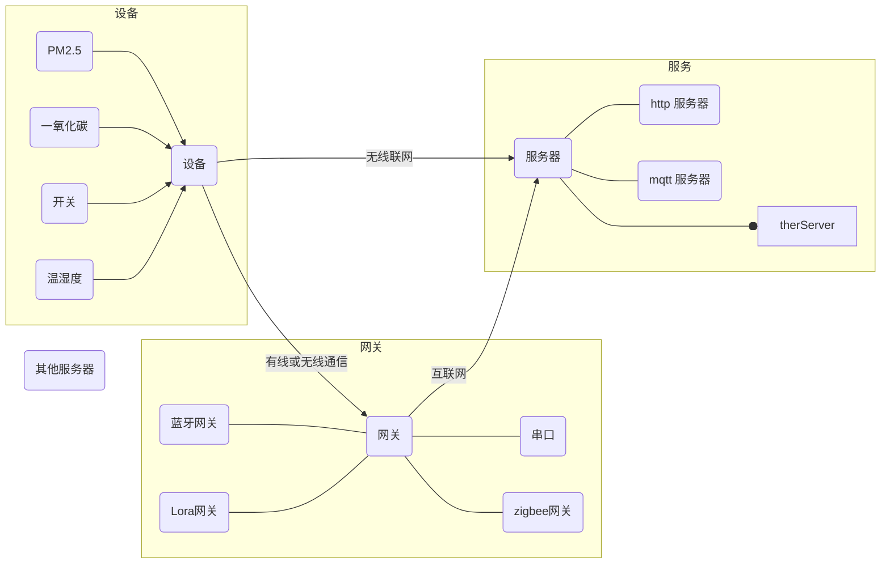

# ARM课程笔记

[TOC]

## 软件安装

## 嵌入式开发简介

### arm历史版本

arm 公司不做芯片，只研`cpu`架构

arm1、arm2、arm3  .... arm6

| version | cpu            | soc          | cpu num |
| ------- | -------------- | ------------ | ------- |
| v4      | arm7TDMI       | S3C44B0      | 1       |
|         | arm920T        | s3C2440      | 1       |
| V6      | arm1176        | S3C6410      | 1       |
| V7      | arm-contex-a8  | S5PV210      | 1       |
|         |                | AM335X       | 1       |
|         | arm-contex-a9  | Exyonsar4412 | 4       |
|         |                | IMXA6Q       | 4       |
|         |                | IMXA6D       | 2       |
|         |                | OMAP4460     | 2       |
|         |                | S5P4418      | 4       |
|         | arm-contex-r   | r4/r6        |         |
|         | arm-contex-m3  | STM32F103    | 1       |
|         | arm-contex-m4  | STM32F407    | 1       |
| V8      | arm-contex-a53 | S5P6818      | 8       |

## Linux 区别与 Android

`app` 			 **QQ 微信 游戏 控制界面**

`GUI` 			 **QT(C++) Android(Java) GTK(C) MiniGUI(C)**

`本地可执行程序`      **ls mkdir sudo mv ....**

`本地库` 			 **libc.so.6 libjpeg.so libstdc++ ....**

`文件系统`

`kernel`			 **Linux Android windows**

`bootloader`		 **uboot **

------

`板卡` =SOC+DDR+EMMC(NAND)+LCD+TS+SOUND+NET.....

`SOC` =CPU+总线+外设(控制器：uart、gpio)

`cpu` = arm-cortex+cache(哈佛结构：数据cache 指令cache;冯诺伊曼：统一cache )+mmu+GIC+.....

------

`Linux`

​	uboot---->uImage/zImage----->rootfs

​	emmc[uboot uImage |rootfs]

`Android` 最低arm-contex-a8

​	Uboot----->uImage/zImage----->ramdisk /

​								---->system 	root权限(出场软件)

​								---->data		家目录(安装的软件)

​								---->cache	缓存

​								---->storage	存储内容

​	emmc[uboot uImage ramdisk|system|data|cache|storage]

## 开发板和SDK

### sdk目录介绍

```shell
├── s5p6818sdk_lzy1
│   ├── extern
│   ├── Linux
│   └── package
```

> `s5p6818sdk_lzy1` 为`SDK`根目录
>
>  `extern`存储一些其他资源
>
> `Linux` 存储`SDK`的文件
>
> `package` 存储手册

### extern目录介绍

```shell
extern/
├── arm-linux-gcc-4.5.1.tar.bz2 #交叉编译器
├── ARM架构手册.pdf
├── jdk-7u80-linux-x64.tar.gz
├── lamp_off1.png
├── lamp_off.png
├── lamp_on1.png
├── lamp_on.png
├── sqlite-autoconf-3170000.tar.gz #sqlite数据库源码
└── x6818bv3.pdf #开发板原理图
```

### Linux目录介绍

```shell
Linux/
├── images #存储现在已经有的一些镜像文件
├── prebuilts #编译内核和uboot的交叉比编译器目录
├── src #源码目录
└── tools #制作boot.img文件的目录
```

## package 目录介绍

```shell
package/
├── DataSheet #芯片数据手册
├── dic  
├── hardware #硬件原理图
├── source
└── tool
```

### package/src目录介绍

```shell
src/
├── buildroot_dl.tar.gz #buidroot 需要的软件包
├── buildroot.tar.bz2 #buildroot 源码文件
├── linux
├── linux-3.4.tar.bz2 #linux 源码文件
├── prototype
└── uboot6818.tar.bz2 #uboot源码文件
```

## 搭建嵌入式开发环境

### 配置交叉编译器

解压交叉编译器

```shell
cd ~/s5p6818sdk_lzy1/extern/
tar -xvf arm-linux-gcc-4.5.1.tar.bz2 -C /opt
```

配置环境变量

```shell
vim ~/.bashrc
#文件末尾添加
export PATH=$PATH:/opt/4.5.1/bin
```

刷新环境变量

```shell
source ~/.bashrc
```

## 创建sd卡分区

1. 将内存卡插入`读卡器`接入电脑

2. 卸载U盘

   ```shell
   sudo umount /dev/sdb1
   ```

   >  **注：`/dev/sdb` 为存储设备,`/dev/sdb1`、`/dev/sdb2` ..... 为该存储设备的分区**

3. 执行分区命令

   > 计算分区的大小 :
   > $$
   > (end-start)*0.1+start
   > $$
   > 例子：
   >
   > First sector (2048-62963711, default 2048):
   >
   > （62963711-2048）×0.1 +  2048=6298214
   >
   > 注：
   >
   > 分区的最小为 uboot大小+512Kb

   ```shell
   sudo fdisk /dev/sdb
   Welcome to fdisk (util-linux 2.27.1).
   Changes will remain in memory only, until you decide to write them.
   Be careful before using the write command.
   ```


   命令(输入 m 获取帮助)：p
   Disk /dev/sdb: 30 GiB, 32237420544 bytes, 62963712 sectors
   Units: sectors of 1 * 512 = 512 bytes
   Sector size (logical/physical): 512 bytes / 512 bytes
   I/O size (minimum/optimal): 512 bytes / 512 bytes
   Disklabel type: dos
   Disk identifier: 0x00000000

   设备       启动   Start   末尾   扇区 Size Id 类型
   /dev/sdb1       6298214 62963711 56665498  27G  b W95 FAT32

   命令(输入 m 获取帮助)：d
   Selected partition 1
   Partition 1 has been deleted.

   命令(输入 m 获取帮助)： p

   Disk /dev/sdb: 30 GiB, 32237420544 bytes, 62963712 sectors
   Units: sectors of 1 * 512 = 512 bytes
   Sector size (logical/physical): 512 bytes / 512 bytes
   I/O size (minimum/optimal): 512 bytes / 512 bytes
   Disklabel type: dos
   Disk identifier: 0x00000000

   命令(输入 m 获取帮助)： n
   Partition type
      p   primary (0 primary, 0 extended, 4 free)
      e   extended (container for logical partitions)
   Select (default p): p
   分区号 (1-4, default 1):
   First sector (2048-62963711, default 2048): 6298214
   Last sector, +sectors or +size{K,M,G,T,P} (6288214-62963711, default 62963711):
   Created a new partition 1 of type 'Linux' and of size 27 GiB.

   命令(输入 m 获取帮助):t
   Partition type (type L to list all types): b
   Changed type of partition 'Linux' to 'W95 FAT32'.

   命令(输入 m 获取帮助)：w
   The partition table has been altered.
   Calling ioctl() to re-read partition table.
   Syncing disks.
   ```

4. 格式化SD卡分区

   ```shell
   sudo mkfs.vfat /dev/sdb1
   ```

   > 注意：`/dev/sdb` 为SD卡设备，在自己电脑上名字有可能改变
   >
   > 格式化时一定要格式化分区，即`/dev/sdb1`

## 烧写uboot和配置minicom

### 烧写uboot

```shell
 sudo dd if=ubootpak.bin of=/dev/sdb seek=1
 sync
```

> 注 ubootpak.bin 文件在 `$SDK_PATH/s5p6818sdk_lzy1/Linux/images`中

### 配置minicom

```shell
sudo minicom -s

    +-----[configuration]------+
    | Filenames and paths      |
    | File transfer protocols  |
    | Serial port setup        |
    | Modem and dialing        |
    | Screen and keyboard      |
    | Save setup as dfl        |
    | Save setup as..          |
    | Exit                     |
    | Exit from Minicom        |
    +--------------------------+
    # 选择 Serial port setup 按 Enter 按键进入下面的界面
 	+-----------------------------------------------------------------------+
    | A -    Serial Device      : /dev/ttyUSB0                              |
    | B - Lockfile Location     : /var/lock                                 |
    | C -   Callin Program      :                                           |
    | D -  Callout Program      :                                           |
    | E -    Bps/Par/Bits       : 115200 8N1                                |
    | F - Hardware Flow Control : No                                        |
    | G - Software Flow Control : No                                        |
    |                                                                       |
    |    Change which setting?                                              |
    +-----------------------------------------------------------------------+
    # 输入 A 修改 Serial Device 为 /dev/ttyUSB0
    # 输入 E 进入下面的界面
   +---------[Comm Parameters]----------+
   |                                    |
   |     Current: 115200 8N1            |
   | Speed            Parity      Data  |
   | A: <next>        L: None     S: 5  |
   | B: <prev>        M: Even     T: 6  |
   | C:   9600        N: Odd      U: 7  |
   | D:  38400        O: Mark     V: 8  |
   | E: 115200        P: Space          |
   |                                    |
   | Stopbits                           |
   | W: 1             Q: 8-N-1          |
   | X: 2             R: 7-E-1          |
   |                                    |
   |                                    |
   | Choice, or <Enter> to exit?        |
   +------------------------------------+
   #输入 E 按 Enter 回到
	+-----------------------------------------------------------------------+
    | A -    Serial Device      : /dev/ttyUSB0                              |
    | B - Lockfile Location     : /var/lock                                 |
    | C -   Callin Program      :                                           |
    | D -  Callout Program      :                                           |
    | E -    Bps/Par/Bits       : 115200 8N1                                |
    | F - Hardware Flow Control : Yes                                       |
    | G - Software Flow Control : No                                        |
    |                                                                       |
    |    Change which setting?                                              |
    +-----------------------------------------------------------------------+
  # 输入 F 关闭硬件流控
  	+-----------------------------------------------------------------------+
    | A -    Serial Device      : /dev/ttyUSB0                              |
    | B - Lockfile Location     : /var/lock                                 |
    | C -   Callin Program      :                                           |
    | D -  Callout Program      :                                           |
    | E -    Bps/Par/Bits       : 115200 8N1                                |
    | F - Hardware Flow Control : No                                        |
    | G - Software Flow Control : No                                        |
    |                                                                       |
    |    Change which setting?                                              |
    +-----------------------------------------------------------------------+
   # 按 Enter 按键保存 ，回到主菜单
   +-----[configuration]------+                                     
   | Filenames and paths      |                                     
   | File transfer protocols  |                                     
   | Serial port setup        |                                     
   | Modem and dialing        |                                     
   | Screen and keyboard      |                    
   | Save setup as dfl        |                    
   | Save setup as..          |                    
   | Exit                     |                    
   | Exit from Minicom        |                    
   +--------------------------+
   # 选择 Save setup as dfl 按 Enter 保存为默认配置
   # 选择 Exit from Minicom 按 Enter 退出配置
```

### 开发板刷机

1. 下载软件包

   ```shell
   sudo apt install android-tools-fastboot
   ```

2. 将usb转串口和开发板连接

3. 将Android线和电脑连接

4. 打开`minicom`

   ```shell
   sudo minicom
   ```

5. 打开开发板，然后计入`uboot` 命令终端

   - 看着minicom
   - 开发板上电，等待`minicom`上打印的消息出现倒计时，按`空格` 键进入 `uboot` 命令终端
   - 执行`fastboot` 命令

6. 进入到 `$SDK_PATH/Linux/images`,执行刷机脚本

   ```shell
   sudo ./flush.sh
   ```
   刷机脚背详解

   > 烧写uboot

   ```shell
   sudo fastboot flash ubootpak ubootpak.bin
   ```

   > 烧写boot.img(有kernel、启动图片、刷机图片、ramdisk、ramdisk-recovery.img ....)

   ```shell
   sudo fastboot flash boot boot.img
   ```

   > 烧写文件系统

   ```shell
   sudo fastboot flash system rootfs.ext2
   ```


7. 命令执行完毕之后，重启开发板

8. 设置开发的内核启动参数，在`uboot`中执行命令

   ```
   setenv bootargs "root=/dev/mmcblk0p2 rootfstype=ext4 console=ttySAC0,115200 lcd=wy070ml  tp=gslx680-linux"
   ```

   ```shell
   setenv bootcmd "ext4load mmc 2:1 0x48000000 uImage;bootm 0x48000000"
   ```

   ```shell
   save
   ```

   ```shell
   reset
   ```

## 编译`uboot`

1. 解压源码

   ```shell
   cd /opt/UEA_10_08/s5p6818sdk_lzy1/Linux/src
   tar -xvf uboot6818.tar.bz2
   ```

2. 进入 `uboot` 源码目录修改 `Makefile`

   ```shell
   cd uboot
   vim Makefile
   ```

   ```shell
   # 将 203 行修改为下面的值
   CROSS_COMPILE=/opt/UEA_10_08/s5p6818sdk_lzy1/Linux/prebuilts/gcc/linux-x86/arm/arm-eabi-4.8/bin/arm-eabi-
   ```

3. 修改 `board/s5p6818/x6818/config.mk` 文件

   ```shell
   vim board/s5p6818/x6818/config.mk
   ```

   ```shell
   # 将 27 行修改为下面的值
   CROSS_COMPILE=/opt/UEA_10_08/s5p6818sdk_lzy1/Linux/prebuilts/gcc/linux-x86/arm/arm-eabi-4.8/bin/arm-eabi-
   ```

4. 花屏再做如下修改

   ```shell
   vim board/s5p6818/x6818/x6818-lcds.c
   ```

   ```shell
   #将 215行替换为如下内容
   CFG_DISP_MIPI_PLLPMS = 0x2281;
   #将 216行替换为如下内容
   CFG_DISP_MIPI_BANDCTL = 0x8;
   ```

5. 重新编译

   ```shell
   make x6818_config
   make -j4
   ```

6. 烧写 uboot

   ```shell
   sudo fastboot flash ubootpak ubootpak.bin
   ```

## 编译内核

1. 解压内核源码

   ```shell
   cd /opt/UEA_10_08/s5p6818sdk_lzy1/Linux/src/
   tar -xvf linux-3.4.tar.bz2
   ```

2. 进入内核目录，修改`Makefile`

   ```shell
   cd kernel/
   vim Makefile
   ```

   ```makefile
   #将 Makefile 的 196 行替换为下面的内容
   CROSS_COMPILE   ?= /opt/UEA_10_08/s5p6818sdk_lzy1/Linux/prebuilts/gcc/linux-x86/arm/arm-eabi-4.8/bin/arm-eabi-
   ```

3. 修改屏幕花屏问题

   ```shell
   vim arch/arm/plat-s5p6818/x6818/x6818-lcds.c
   ```

   ```c
   // 将208行替换为以下内容
   CFG_DISP_MIPI_BANDCTL = 0x8;
   ```

4. 修改触摸屏幕的触摸点与实际相反的问题

   ```shell
   vim drivers/input/touchscreen/gslX680.c
   ```

   ```c
   //在36行下面添加
   extern unsigned char lcdname[32];
   ```

   ```c
   // 在50行下面添加
   static int is_rotate= 0;
   ```

   ```c
   /*
   删除 703 行附近的
   id = cinfo.id[i];
   x =  cinfo.x[i];
   y =  cinfo.y[i];
   替换为
   */
   if(is_rotate > 0){
   	id = cinfo.id[i];
   	x =  SCREEN_MAX_Y - cinfo.x[i];
   	y =  SCREEN_MAX_X - cinfo.y[i];
   }
   else{
   	id = cinfo.id[i];
   	x =  cinfo.x[i];
   	y =  cinfo.y[i];
   }
   ```

   ```c
   // 在1153 行下面添加以下内容
   if(strcasecmp(lcdname, "wy070ml") == 0){
   	printk("wy070ml: gslx680 Touch Driver\n");
   	is_rotate =1;
   }
   else{
   	is_rotate = 0;
   }
   ```

5. 修改内核编译过程中找不到 `lcdname` 变量的问题

   ```shell
   vim arch/arm/plat-s5p6818/x6818/x6818-lcds.c
   ```

   ```c
   // 替换59行为
   unsigned char lcdname[32] = "vs070cxn";
   ```

   ```c
   // 在 59 行下添加
   EXPORT_SYMBOL(lcdname);
   ```

6. 使用默认配置，并编译内核

   ```
   make x6818_defconfig
   make -j4
   ```

7. 生成`uImge`镜像

   ```shell
   make uImage
   ```

   >注：如何执行出错，修要下载
   >
   >```shell
   >sudo apt install u-boot-tools
   >```

### 生成boot.img

1. 进入存在boot的文件夹

   ```shell
   cd /opt/UEA_10_08/s5p6818sdk_lzy1/Linux/tools
   ```

2. 解压 `boot.tar.bz2`

   ```shell
   tar -xvf boot.tar.bz2
   ```

3. 使用自己编译出来的`uImage`替换`boot`文件夹中的内容

   ```shell
   cd boot/
   cp /opt/UEA_10_08/s5p6818sdk_lzy1/Linux/src/kernel/arch/arm/boot/uImage ./
   ```

4. 制作`boot.img`

   ```shell
   cd ../
   ./make_ext4fs -s -l 60M -a boot boot.img ./boot
   ```
   > 注：出错 下载
   >
   > ```shell
   > sudo apt install lib32stdc++
   > ```
   >
   >

5. 烧写 boot.img（跟新内核）

   ```shell
    sudo fastboot flash boot boot.img
   ```


## 编译文件系统

先下载一些软件包

```shell
sudo apt install texinfo
```

1. 进入源码目录,解压源码

   ```shell
   cd/opt/UEA_10_08/s5p6818sdk_lzy1/Linux/src
   tar -xvf buildroot.tar.bz2
   cd buildroot/
   ```

2. 使用默认配置

   ```shell
   make x6818_defconfig
   make
   ```

3. 等待出现`../include/curses.h:1594:56: note: in definition of macro ‘mouse_trafo’` 错误

   ```shell
   vim ./output/build/host-ncurses-5.9/include/curses.h
   ```

   ```c
   // 替换 1584 行为
   extern NCURSES_EXPORT(bool)    mouse_trafo (int*, int*, bool);
   ```

   ```shell
   vim ./output/build/host-ncurses-5.9/include/curses.tail
   ```

   ```c
   // 替换 104 行为
   extern NCURSES_EXPORT(bool)    mouse_trafo (int*, int*, bool);
   ```

4. 重新编译

   ```shell
   make
   ```


## 配置网络下载内核启动

1. 下载软件

   ```shell
   sudo apt install tftpd-hpa
   ```

2. 配置`tftpd-hpa`软件

   ```shell
   vim /etc/default/tftpd-hpa
   ```

   ```
   TFTP_USERNAME="tftp"
   TFTP_DIRECTORY="/tftpboot"
   TFTP_ADDRESS=":69"
   TFTP_OPTIONS="-l -c -s"
   ```

3. 创建 `/tftpboot`文件夹，并修改所属用户和组,并重启tftp服务

   ```shell
   sudo mkdir /tftpboot
   sudo chown `whoami`:`whoami` /tftpboot
   sudo service tftpd-hpa restart
   ```

4. 设置pc的ip地址

   >网关为 192.168.100.254
   >
   >ip为 192.168.100.155
   >
   >掩码为 255.255.255.0

5. 进入uboot，设置uboot环境变量

   ```shell
   setenv gatewayip "192.168.100.254"
   setenv ipaddr "192.168.100.123"
   setenv netmask "255.255.255.0"
   setenv serverip "192.168.100.155"
   save
   ```

6. 开发板`ping` 电脑

   ```
   ping 电脑ip
   ```

   > 注：
   >
   > 电脑如果和开发板可以通信，命令的执行结果为 `host 192.168.100.155 is alive`
   >
   > 电脑如果和开发板不可以通信，命令的执行结果为 `ping failed; host 192.168.100.155 is not alive`
   >
   > 第一次`ping` 不会成功，一般最少需要两次

7. 网络下载内核

   1. 将 uImage文件发到 `/tftpboot` 目录下

     ```shell
     cp /opt/UEA_10_08/s5p6818sdk_lzy1/Linux/src/kernel/arch/arm/boot/uImage /tftpboot/
     ```

   2. 在uboot中执行以下的任何一条命令即可

     ```shell
     tftpboot 0x48000000 uImage
     ```

     或

     ```shell
     tftp 0x48000000 uImage
     ```

     或

     ```shell
     tftp
     ```

     > 注：三条命令都可以，但是在设置环境变量时，必须使用第一条命令

8. 启动内核

   ```shell
   bootm 0x48000000
   ```

9. 设置 uboot 的开机自动下载内核并启动`bootcmd`参数

   ```shell
   setenv bootcmd "ping 192.168.6.6;ping 192.168.6.6;tftpboot 0x48000000 uImage;bootm 0x48000000"
   save
   ```

   > 注 192.168.6.6 为自己tftp服务器的地址

## 网络挂在文件系统启动开发板

1. 下载软件

   ```shell
   sudo apt install nfs-kernel-server
   ```

2. 配置`nfs`

   ```shell
   sudo vim /etc/exports
   ```

   ```sehll
   # 在文件最后，添加以下内容
   /rootfs *(rw,sync,no_root_squash)
   ```

3. 创建文件夹,并修改所属用户和组

   ```shell
   sudo mkdir /rootfs
   sudo chown `whoami`:`whoami` /rootfs
   ```

4. 重启nfs服务

   ```shell
   sudo service nfs-kernel-server restart
   ```

5. 解压文件系统

   ```shell
   cp /opt/UEA_10_08/s5p6818sdk_lzy1/Linux/src/buildroot/output/images/rootfs.tar /rootfs/
   cd /rootfs
   sudo tar -xvf rootfs.tar
   ```

6. 修改文件内容

   ```shell
   sudo vim etc/network/interfaces
   ```

   ```
   #将文件内容替换为以下内容
   # Configure Loopback
   auto lo
   iface lo inet loopback

   auto eth0
   #iface eth0 inet dhcp
   ```

7. 修改 uboot的`bootargs`

   ```shell
   setenv bootargs "root=/dev/nfs nfsroot=192.168.6.6:/rootfs ip=192.168.6.15 console=ttySAC0,115200 lcd=wy070ml tp=gslx680-linux"
   save
   ```

## 配置交叉编译器

1. 修改`~/.bashrc `

   ```shell
   vim ~/.bashrc
   ```

   ```shell
   #在最后添加
   export PATH=$PATH:/opt/UEA_10_08/s5p6818sdk_lzy1/Linux/src/buildroot/output/host/usr/bin
   ```

2. 更新环境变量

   ```shell
    source ~/.bashrc
   ```

## 添加系统调用

一切都在编译的内核目录修改的，目录是 `/opt/UEA_10_08/s5p6818sdk_lzy1/Linux/src/linux-3.4`

1. 修改 `arch/arm/include/asm/unistd.h`

   ```shell
   vim arch/arm/include/asm/unistd.h
   ```

   ```c
   // 在 #define __NR_process_vm_writev          (__NR_SYSCALL_BASE+377) 下添加内容
   #define __NR_myadd          (__NR_SYSCALL_BASE+378)
   ```

2. 修改 `arch/arm/kernel/calls.S`

    ```shell
      vim arch/arm/kernel/calls.S
    ```

   ```c
   // 在 CALL(sys_process_vm_writev) 下添加
   CALL(sys_myadd)
   ```

3. 修改 `arch/arm/kernel/sys_arm.c`

   ```shell
   vim arch/arm/kernel/sys_arm.c
   ```

   ```c
   //在文件最后添加
   asmlinkage int sys_myadd(int a, int b)
   {
           return a+b;
   }
   ```

4. 重新编译内核

   ```shell
   make -j4
   make uImage
   ```

5. 将内核放到 tftpboot 目录下

   ```shell
   cp /opt/UEA_10_08/s5p6818sdk_lzy1/Linux/src/linux-3.4/arch/arm/boot/uImage /tftpboot/
   ```

6. [通过网络下载内核启动](## 配置网络下载内核启动)

7. 编译例子，并将程序放入pc `/rootfs` 目录下

8. 开发板挂在PC共享的目录

   ```shell
   #设置 开发板ip
   ifconfig eth0 192.168.100.12 up
   #开发板挂在PC目录
   mount -t nfs -o nolock 192.168.100.155:/rootfs /mnt
   ```

9. 运行验证程序

## 在kernel中添加module

1. 在内核源码目录中的`drivers`下创建 `uplooking` 目录

   ```shell
   cd /opt/UEA_10_08/s5p6818sdk_lzy1/Linux/src/linux-3.4
   mkdir drivers/uplooking
   ```

2. 在 `drivers/uplooking` 添加`Makefile` 、`uplooking.c` 文件

   ```shell
   touch drivers/uplooking/Makefile drivers/uplooking/uplooking.c
   ```

3. 在 `drivers/uplooking/Makefile` 中添加如下内容

   ```makefile
   obj-y=uplooking.o
   ```

4. 在 `drivers/uplooking/uplooking.c` 中添加如下内容

   ```c
   #define PERR(fmt, args...)                                                     \
     do {                                                                         \
       printk(KERN_ERR "[%s:%d]" fmt, __FUNCTION__, __LINE__, ##args);            \
     } while (0)

   #include <linux/init.h>
   #include <linux/module.h>

   /**
    * [MODULE_LICENSE 声明该模块遵循的协议]
    */
   MODULE_LICENSE("GPL");
   /**
    * [uplooking_init 内核模块的初始化函数,__init
    * 关键字表明该函数是在模块初始化的时候执行的，模块初始化完成之后，会释放该函数所占的内存]
    * @return  [成功返回 0,失败返回非 0 ]
    */
   static __init int uplooking_init(void) {
     int i = 0;
     for (i = 0; i < 100; i++)
       PERR("INIT\n");
     return 0;
   }

   /**
    * [uplooking_exit 内核模块的退出函数,__exit
    * 关键字表明该函数是在模块退出的时候执行的，如果模块被编译到内核中，该代码段不会被编译]
    */
   static __exit void uplooking_exit(void) {
     PERR("EXIT\n");
     return;
   }

   /**
    * [module_init 注册模块初始化函数]
    */
   module_init(uplooking_init);
   /**
    * [module_exit 注册模块退出函数]
    */
   module_exit(uplooking_exit);
   ```

5. 修改 `drivers/Makefile` 文件

   ```shell
   vim drivers/Makefile
   ```

   ```makefile
   #在 obj-y += pinctrl/ 下一行添加如下内容
   obj-y                           += uplooking/
   ```

6. 编译内核

   ```shell
   make -j4
   make uImage
   ```

7. 将内核放到tftpboot目录

8. 网络下载内核启动开发板

## 编写`menuconfig` 的配置文件`Kconfig`

### Kconfig 语法

- config

  config <symbol>

   <config options>

  config是关键字，表示一个配置选项的开始；紧跟着的<symbol>是配置选项的名称，省略了前缀"CONFIG_"。

  例如：

> config TMPFS_POSIX_ACL
>
>  bool "Tmpfs POSIX Access Control Lists"
>
>  ​	depends on TMPFS
>
>  ​	select GENERIC_ACL
>
>  ​	help
>
>  POSIX Access Control Lists (ACLs) support permissions for users and
>
>  groups beyond the owner/group/world scheme.
>
>  To learn more about Access Control Lists, visit the POSIX ACLs for
>
>  Linux website <http://acl.bestbits.at/>.
>
>  解析：config是关键字，表示一个配置选项的开始；紧跟着的TMPFS_POSIX_ACL是配置选项的名称，省略了前缀"CONFIG_"
>
>  bool表示变量类型，即"CONFIG_ TMPFS_POSIX_ACL "的类型，有5种类型：bool、tristate、string、hex和int，其中tristate和string是基本的类型
>
>  ​ bool变量的值：     y和n
>
>  tristate变量的值： y、n和m
>
>  ​ string变量的值：   字符串
>
>  ​ bool之后的字符串“Tmpfs POSIX Access Control Lists”是提示信息，在配置界面中上下移动光标选中它时，就可以通过按空格或回车键来设置CONFIG_ TMPFS_POSIX_ACL的值。
>
>  depends on：表示依赖于XXX，“depends on TMPFS”表示只有当TMPFS配置选项被选中时，当前配置选项的提示信息才会出现，才能设置当前配置选项。

- menuconfig

  menuconfig <symbol>

    <config options>

  此关键字和前面的关键字很相似，但它在前面的基础上要求所有的子选项作为独立的行显示。

- choice/endchoice

  choice

     <choice options>

     <choice block>

  endchoice

  该关键字定义了一组选择项，并且选项可以是前面描述的任何属性。尽管boolean只允许选择一个配置选项，tristate可以抒多个配置选项设为'm'，但选项只能是boolean或tristate类型。这可以在一个硬件有多个驱动的情况下使用，最终只有一个驱动被编译进/加载到内核，但所有的驱动都可以编译成模块。选项可以接受的另一个选项是"optional"，这样选项就被设置为'n'，没有被选中的。

  例如：

  > choice条目将多个类似的配置选项组合在一起，供用户单选或多选
  >
  > ​       choice
  >
  > ​             prompt "ARM system type"
  >
  > ​             default ARCH_VERSATILE
  >
  > ​             config ARCH_AAEC2000
  >
  > ​                  .........
  >
  > ​             config ARCH_REALVIEW
  >
  > ​                  .........
  >
  > ​        endchoice
  >
  > ​      prompt "ARM system type"给出提示信息“ARM system type”，光标选中后回车进入就可以看到多个config条目定义的配置选项。choice条目中定义的变量只有bool和tristate。

- comment

  "comment" <prompt>

   <comment options>

  这里定义了在配置过程中显示给用户的注释，该注释还将写进输出文件中。唯一可用的可选项是依赖关系。

  例如：

> comment条目用于定义一些帮助信息，出现在界面的第一行，如在arch/arm/Kconifg中有如下代码：
>
>  
>
>  
>
>   menu "Floating point emulation"
>
>  ```
>  	comment "At least one emulation must be selected"
>  
>  	config FPE_NWFPE
>  
>  	.........                                                                              
>  
>  	config FPE_NWFPE_XP
>  
>  ```
>
>    endmenu


- menu/endmenu

  "menu" <prompt>

    <menu options>

    <menu block>

    "endmenu"

  这里定义了一个菜单，详细信息请看前面的"菜单结构"。唯一可用的可选项是依赖关系。

  例如：

> menu条目用于生成菜单，其格式如下：
>
>  ```
>    Floating poing emulation--->
>  
>  ​	[] FPE_NWFPE
>  
>   	[] FPE_NWFPE_XP              
>  
>  ```

- if/endif

  "if" <expr>

     <if block>

     "endif"

  这里定义了if结构。依赖关系<expr>被加到所有在if ... endif 中的菜单选项中。

- source

  source条目用于读取另一个Kconfig文件，如：

  > source "net/Kconifg"

### 根据`Kconfig` 生成的文件

1. `include/config/auto.conf`

   内核中所有的`Makefile` 文件都会引用该文件

2. `include/generated/autoconf.h`

   内核中所有代码都会包含此文件

### 使用编写`Kconfig` 文件

例如，在uplooking下创建了`kconfig` 文件修要在上一级目录的kconfig文件

```shell
cd /opt/UEA_10_08/s5p6818sdk_lzy1/Linux/src/linux-3.4/drivers/uplooking
vim ../Kconfig
```

```makefile
# 在 source "drivers/base/Kconfig" 下体添加
source "drivers/uplooking/Kconfig"
```

## 编写内核模块

### 编译单个内核模块

```makefile
# @Author: fjk
# @Date:   2018-10-11T14:05:49+08:00
# @Email:  sunnyfjk@gmai.com
# @Filename: Makefile
# @Last modified by:   fjk
# @Last modified time: 2018-10-11T14:26:32+08:00
# @License: GPL
TAGET=Kernel01
obj-m=$(TAGET).o
KERN_PATH=/opt/UEA_10_08/s5p6818sdk_lzy1/Linux/src/linux-3.4
PWD=$(shell pwd)
all:
	make -C $(KERN_PATH) M=$(PWD) modules
	cp $(PWD)/$(TAGET).ko /rootfs
clean:
	make -C  $(KERN_PATH) M=$(PWD) clean

```

> TAGET需要生成ko的名字，需要有和它同名 `.c` 文件
>
> obj-m 他的值为编译成内核模块的`.c` 文件所对应的`.o` 文件
>
> KERN_PATH **编译过的内核源码**的路径
>
> PWD 内核模块源码的路径

```shell
make -C $(KERN_PATH) M=$(PWD) modules
# 去指定的$(KERN_PATH)目录找 Makefile 执行
# M=$(PWD)  让内核的Makefile找到当前的内核源码编译
# modules 编译内核模块的命令
```

```c
/**
 * @Author: fjk
 * @Date:   2018-10-11T14:05:58+08:00
 * @Email:  sunnyfjk@gmai.com
 * @Filename: Kernel01.c
 * @Last modified by:   fjk
 * @Last modified time: 2018-10-11T14:13:53+08:00
 * @License: GPL
 */
#include <linux/init.h>
#include <linux/module.h>

#define PERR(fmt, args...)                                                     \
  do {                                                                         \
    printk(KERN_ERR "[%s:%d]" fmt, __FUNCTION__, __LINE__, ##args);            \
  } while (0)

MODULE_LICENSE("GPL");

static __init int Kernel01_init(void) {
  PERR("INIT\n");
  return 0;
}

static __exit void Kernel01_exit(void) {
  PERR("EXIT\n");
  return;
}

module_init(Kernel01_init);
module_exit(Kernel01_exit);
```

### 编译多个模块

```makefile
# @Author: fjk
# @Date:   2018-10-11T14:05:49+08:00
# @Email:  sunnyfjk@gmai.com
# @Filename: Makefile
# @Last modified by:   fjk
# @Last modified time: 2018-10-11T14:22:45+08:00
# @License: GPL
TAGET=Kernel02
TAGET01=Kernel02_01
obj-m=$(TAGET).o $(TAGET01).o
KERN_PATH=/opt/UEA_10_08/s5p6818sdk_lzy1/Linux/src/linux-3.4
PWD=$(shell pwd)
all:
	make -C $(KERN_PATH) M=$(PWD) modules
	cp $(PWD)/*.ko /rootfs
clean:
	make -C  $(KERN_PATH) M=$(PWD) clean
```

> obj-m 如果会面有多个 `.o` 则将`.o` 所对应的`.c` 文件都编译为内核模块

```c
/**
 * @Author: fjk
 * @Date:   2018-10-11T14:20:05+08:00
 * @Email:  sunnyfjk@gmai.com
 * @Filename: Kernel02_01.c
 * @Last modified by:   fjk
 * @Last modified time: 2018-10-11T14:21:28+08:00
 * @License: GPL
 */
#include <linux/init.h>
#include <linux/module.h>

#define PERR(fmt, args...)                                                     \
  do {                                                                         \
    printk(KERN_ERR "[%s:%d]" fmt, __FUNCTION__, __LINE__, ##args);            \
  } while (0)

MODULE_LICENSE("GPL");

static __init int Kernel02_01_init(void) {
  PERR("INIT\n");
  return 0;
}

static __exit void Kernel02_01_exit(void) {
  PERR("EXIT\n");
  return;
}

module_init(Kernel02_01_init);
module_exit(Kernel02_01_exit);
```

```c
/**
 * @Author: fjk
 * @Date:   2018-10-11T14:19:12+08:00
 * @Email:  sunnyfjk@gmai.com
 * @Filename: Kernel02.c
 * @Last modified by:   fjk
 * @Last modified time: 2018-10-11T14:20:53+08:00
 * @License: GPL
 */
#include <linux/init.h>
#include <linux/module.h>

#define PERR(fmt, args...)                                                     \
  do {                                                                         \
    printk(KERN_ERR "[%s:%d]" fmt, __FUNCTION__, __LINE__, ##args);            \
  } while (0)

MODULE_LICENSE("GPL");

static __init int Kernel02_init(void) {
  PERR("INIT\n");
  return 0;
}

static __exit void Kernel02_exit(void) {
  PERR("EXIT\n");
  return;
}

module_init(Kernel02_init);
module_exit(Kernel02_exit);
```

### 将多个`.c` 文件编译成为一个内核模块文件

多个文件编译为同一个内核模块时，只能其中一个文件中存在 `module_init` 和 `module_exit` 函数

```makefile
# @Author: fjk
# @Date:   2018-10-11T14:05:49+08:00
# @Email:  sunnyfjk@gmai.com
# @Filename: Makefile
# @Last modified by:   fjk
# @Last modified time: 2018-10-11T14:26:18+08:00
# @License: GPL
TAGET=Kernel03
obj-m=$(TAGET).o
$(TAGET)-objs=Kernel_main.o Kernel_other.o
KERN_PATH=/opt/UEA_10_08/s5p6818sdk_lzy1/Linux/src/linux-3.4
PWD=$(shell pwd)
all:
	make -C $(KERN_PATH) M=$(PWD) modules
	cp $(PWD)/$(TAGET).ko /rootfs
clean:
	make -C  $(KERN_PATH) M=$(PWD) clean
```

> 多个文件编译成为一个内核模块文件时，`obj-m` 后指定的`.o`文件名字 不能时 但前文件夹中的任何`.c` 所对应的 `.o` 文件
>
> $(TAGET)-objs 后面填写需要将那些`.c` 文件编译成一个内核模块。需要填写`.c` 文件对应的`.o` 文件

````c
/**
 * @Author: fjk
 * @Date:   2018-10-11T14:25:18+08:00
 * @Email:  sunnyfjk@gmai.com
 * @Filename: Kernel_other.c
 * @Last modified by:   fjk
 * @Last modified time: 2018-10-11T14:32:03+08:00
 * @License: GPL
 */
#include <linux/init.h>
#include <linux/module.h>
#define PERR(fmt, args...)                                                     \
  do {                                                                         \
    printk(KERN_ERR "[%s:%d]" fmt, __FUNCTION__, __LINE__, ##args);            \
  } while (0)

void my_printk(void) {
  int i = 0;
  for (i = 0; i < 10; i++)
    PERR("\n");
}
EXPORT_SYMBOL(my_printk);
````

```c
/**
 * @Author: fjk
 * @Date:   2018-10-11T14:25:03+08:00
 * @Email:  sunnyfjk@gmai.com
 * @Filename: Kernel_main.c
 * @Last modified by:   fjk
 * @Last modified time: 2018-10-11T14:31:46+08:00
 * @License: GPL
 */
#include <linux/init.h>
#include <linux/module.h>

#define PERR(fmt, args...)                                                     \
  do {                                                                         \
    printk(KERN_ERR "[%s:%d]" fmt, __FUNCTION__, __LINE__, ##args);            \
  } while (0)

MODULE_LICENSE("GPL");

extern void my_printk(void);

static __init int Kernel03_init(void) {
  PERR("INIT\n");
  my_printk();
  return 0;
}

static __exit void Kernel03_exit(void) {
  PERR("EXIT\n");
  return;
}

module_init(Kernel03_init);
module_exit(Kernel03_exit);
```

### 模块之间的依赖关系

```makefile
# @Author: fjk
# @Date:   2018-10-11T14:05:49+08:00
# @Email:  sunnyfjk@gmai.com
# @Filename: Makefile
# @Last modified by:   fjk
# @Last modified time: 2018-10-11T14:34:51+08:00
# @License: GPL
TAGET=Kernel04
TAGET01=Kernel04_01
obj-m=$(TAGET).o $(TAGET01).o
KERN_PATH=/opt/UEA_10_08/s5p6818sdk_lzy1/Linux/src/linux-3.4
PWD=$(shell pwd)
all:
	make -C $(KERN_PATH) M=$(PWD) modules
	cp $(PWD)/*.ko /rootfs
clean:
	make -C  $(KERN_PATH) M=$(PWD) clean
```

```c
/**
 * @Author: fjk
 * @Date:   2018-10-11T14:19:12+08:00
 * @Email:  sunnyfjk@gmai.com
 * @Filename: Kernel04.c
 * @Last modified by:   fjk
 * @Last modified time: 2018-10-11T14:35:23+08:00
 * @License: GPL
 */
#include <linux/init.h>
#include <linux/module.h>

#define PERR(fmt, args...)                                                     \
  do {                                                                         \
    printk(KERN_ERR "[%s:%d]" fmt, __FUNCTION__, __LINE__, ##args);            \
  } while (0)

MODULE_LICENSE("GPL");

extern void my_printk(void);

static __init int Kernel04_init(void) {
  PERR("INIT\n");
  my_printk();
  return 0;
}

static __exit void Kernel04_exit(void) {
  PERR("EXIT\n");
  return;
}

module_init(Kernel04_init);
module_exit(Kernel04_exit);
```

```c
/**
 * @Author: fjk
 * @Date:   2018-10-11T14:20:05+08:00
 * @Email:  sunnyfjk@gmai.com
 * @Filename: Kernel04_01.c
 * @Last modified by:   fjk
 * @Last modified time: 2018-10-11T14:34:39+08:00
 * @License: GPL
 */
#include <linux/init.h>
#include <linux/module.h>

#define PERR(fmt, args...)                                                     \
  do {                                                                         \
    printk(KERN_ERR "[%s:%d]" fmt, __FUNCTION__, __LINE__, ##args);            \
  } while (0)

MODULE_LICENSE("GPL");

void my_printk(void) {
  int i = 0;
  for (i = 0; i < 10; i++)
    PERR("\n");
}
EXPORT_SYMBOL(my_printk);

static __init int Kernel04_01_init(void) {
  PERR("INIT\n");
  return 0;
}

static __exit void Kernel04_01_exit(void) {
  PERR("EXIT\n");
  return;
}

module_init(Kernel04_01_init);
module_exit(Kernel04_01_exit);

```

> **如果需要跨模块引用 函数或变量 需要使用 EXPORT_SYMBOL 导出函数或变量的名称**

### 使用 `modprobe` 安装模块时Makefile的写法

```makefile
# @Author: fjk
# @Date:   2018-10-11T14:05:49+08:00
# @Email:  sunnyfjk@gmai.com
# @Filename: Makefile
# @Last modified by:   fjk
# @Last modified time: 2018-10-11T14:41:45+08:00
# @License: GPL
TAGET=Kernel05
TAGET01=Kernel05_01
obj-m=$(TAGET).o $(TAGET01).o
KERN_PATH=/opt/UEA_10_08/s5p6818sdk_lzy1/Linux/src/linux-3.4
PWD=$(shell pwd)
all:
	make -C $(KERN_PATH) M=$(PWD) modules
	cp $(PWD)/*.ko /rootfs
clean:
	make -C  $(KERN_PATH) M=$(PWD) clean
install:
	make -C $(KERN_PATH) M=$(PWD) modules_install INSTALL_MOD_PATH=/rootfs
```

> INSTALL_MOD_PATH 指定要将内核模块下载的根目录

## 内存地址分布(虚拟地址)

### MMU 映射关系

1. 段映射

   查找页表条目：虚拟地址的 [31:20]可找到页表的条目

   条目中保存真实的物理地址的[31:20]

   条目的[31:20] 和 虚拟地址的[19:0]组合找到真实的物理地址

2. 小页映射（最常用的）

   通过虚拟地址的[31:20]找到一级页表的条目

   一级页表条目中的[31:20]位保存二级页表的基地址

   根据居虚拟地址的[19:12]位找到二级页表的条目

   二级页表条目中保存真实的物理地址[31:12]

   二级页表条目[31:12] 和 虚拟地址的[11:0]组合找到真实的物理地址

### 内存管理系统

为了减少内存碎片，保留尽可能多的连续的物理内存

1. buddy
2. slab

[内存映射目录](Documentation/arm/memory.txt)

| Start         | End           | Use                                                          |
| ------------- | ------------- | ------------------------------------------------------------ |
| ffff8000      | ffffffff      |                                                              |
| ffff4000      | ffffffff      |                                                              |
| ffff1000      | ffff7fff      |                                                              |
| ffff0000      | ffff0fff      | arm 异常向两表                                               |
| fffe0000      | fffeffff      | 用于 XScale 芯片                                             |
| fffe8000      | fffeffff      | D_Cache 仅耦合性内存                                         |
| fffe0000      | fffe7fff      | I_Cache 仅耦合性内存                                         |
| fff00000      | fffdffff      | 固定映射区，映射高端内存 kmap_atomic                         |
| ffc00000      | ffefffff      | DMA使用，dma_alloc_xxx 函数申请的内存                        |
| ff000000      | ffbfffff      | 保留的                                                       |
| VMALLOC_START | VMALLOC_END-1 | vmalloc 申请的内存<br />ioremap 物理地址转换为虚拟地址       |
| PAGE_OFFSET   | high_memory-1 | 直接映射区，把普通区映射到次，1:1映射                        |
| PKMAP_BASE    | PAGE_OFFSET-1 | 把高端内存，映射到内核空间，可以使用 kmap                    |
| MODULES_VADDR | MODULES_END-1 | 模块存在的地址。                                             |
| 00001000      | TASK_SIZE-1   | 用户空间使用，每一个线程将空间映射到此。每个用户3-4G的映射都是一样的，0-3G是不一样的 |
| 00000000      | 00000fff      | 没有被映射，不能使用                                         |


### 内存函数

在normal区

alloc_page

\__free_page

alloc_pages

\__free_pages    

\__get_free_page

free_page

\__get_free_pages

free_pages   

page_address   获取页的虚拟地址   

kmap

kunmap

kmap_atomic

\__kummap_atomic

------

常用的

kmalloc     normal  物理和虚拟都是连续的   字节为单位申请

 kzalloc

 kfree

 vmalloc   只能保证虚拟连续   字节申请  分配大的内存，不要求物理上连续  能够把不连续的物理内存，映射到一个连续的虚拟空间

vzalloc

vfree    

dma_alloc_coherent

dma_free_coherent  

缓存

kmem_cache_create

kmem_cache_destory

kmem_cache_alloc

kmem_cache_free  

ioremap   把物理地址映射为虚拟地址

iounmap

## proc 文件系统

- proc 在内存当中。是开机自动挂载的。
- proc sysfs tmpfs ext4 ext2 NTFS VFAT32
- proc 文件系统的头文件为 `include/linux/proc_fs.h`
- 在proc文件系统中 `struct proc_dir_entry` 结构可以表示为 `目录` 和 `文件`
- 会调用 `read_proc_t` 函数的上级函数为 `__proc_file_read`

### 函数

**struct proc_dir_entry *proc_mkdir(const char * name,struct proc_dir_entry *parent);**

|          | 介绍                                                | 备注 |
| -------- | --------------------------------------------------- | ---- |
| 函数功能 | 在proc 文件系统中创建文件夹                         |      |
| 函数参数 | `name` 文件的名字  `parent` 父目录                  |      |
| 返回值   | 成功返回 `创建的目录的结构体的指针` 失败返回 `NULL` |      |

**void remove_proc_entry(const char *name, struct proc_dir_entry *parent);**

|          | 介绍                                          | 备注                            |
| -------- | --------------------------------------------- | ------------------------------- |
| 函数功能 | 删除 proc 中的`目录`或`文件`                  |                                 |
| 函数参数 | `name` `目录`或`文件` 的名字，`parent` 父目录 | 如果没有 父目录 `parent`写 NULL |
| 返回值   | 无                                            |                                 |

**struct proc_dir_entry *create_proc_read_entry(const char *name,umode_t mode, struct proc_dir_entry *base, read_proc_t *read_proc, void * data)**

|          | 介绍                                                         | 备注                               |
| -------- | ------------------------------------------------------------ | ---------------------------------- |
| 函数功能 | 创建只读的proc文件                                           | 内核的旧接口，新版本内核已经不用了 |
| 函数参数 | `name` `文件` 的名字，`mode` 文件的权限 `base` 父目录 `read_proc` 读取的函数 `data` 私有数据 | 如果没有 父目录 `parent`写 NULL    |
| 返回值   | 成功返回 `创建的文件的结构体的指针` 失败返回 `NULL`          |                                    |

**struct proc_dir_entry *create_proc_entry(const char *name, umode_t mode, struct proc_dir_entry *parent)**

|          | 介绍                                                | 备注                                                         |
| -------- | --------------------------------------------------- | ------------------------------------------------------------ |
| 函数功能 | 创建proc文件节点                                    | 需要自己为 `struct proc_dir_entry` 中的 `read_proc`、`write_proc` 、`data` 成员进行赋值 |
| 函数参数 | `name` 文件名字 `mode` 文件权限 `parent` 父级目录   |                                                              |
| 返回值   | 成功返回 `创建的文件的结构体的指针` 失败返回 `NULL` |                                                              |

**struct proc_dir_entry *proc_create_data(const char *name, umode_t mode, struct proc_dir_entry *parent, const struct file_operations *proc_fops, void *data);**

|          | 介绍                                                         | 备注 |
| -------- | ------------------------------------------------------------ | ---- |
| 函数功能 | 创建proc文件节点                                             |      |
| 函数参数 | `name` 文件名字 `mode` 文件权限 `parent` 父级目录 `proc_fops` proc文件操作的接口结构体 `data` 私有数据 |      |
| 返回值   | 成功返回 `创建的文件的结构体的指针` 失败返回 `NULL`          |      |

### 数据结构

**struct file_operations**

```c
struct file_operations {
        struct module *owner;
        loff_t (*llseek) (struct file *, loff_t, int);
        ssize_t (*read) (struct file *, char __user *, size_t, loff_t *);
        ssize_t (*write) (struct file *, const char __user *, size_t, loff_t *);
        ssize_t (*aio_read) (struct kiocb *, const struct iovec *, unsigned long, loff_t);
        ssize_t (*aio_write) (struct kiocb *, const struct iovec *, unsigned long, loff_t);
        int (*readdir) (struct file *, void *, filldir_t);
        unsigned int (*poll) (struct file *, struct poll_table_struct *);
        long (*unlocked_ioctl) (struct file *, unsigned int, unsigned long);
        long (*compat_ioctl) (struct file *, unsigned int, unsigned long);
        int (*mmap) (struct file *, struct vm_area_struct *);
        int (*open) (struct inode *, struct file *);
        int (*flush) (struct file *, fl_owner_t id);
        int (*release) (struct inode *, struct file *);
        int (*fsync) (struct file *, loff_t, loff_t, int datasync);
        int (*aio_fsync) (struct kiocb *, int datasync);
        int (*fasync) (int, struct file *, int);
        int (*lock) (struct file *, int, struct file_lock *);
        ssize_t (*sendpage) (struct file *, struct page *, int, size_t, loff_t *, int);
        unsigned long (*get_unmapped_area)(struct file *, unsigned long, unsigned long, unsigned long, unsigned long);
        int (*check_flags)(int);
        int (*flock) (struct file *, int, struct file_lock *);
        ssize_t (*splice_write)(struct pipe_inode_info *, struct file *, loff_t *, size_t, unsigned int);
        ssize_t (*splice_read)(struct file *, loff_t *, struct pipe_inode_info *, size_t, unsigned int);
        int (*setlease)(struct file *, long, struct file_lock **);
        long (*fallocate)(struct file *file, int mode, loff_t offset,
                          loff_t len);
};
```

| 接口                                                         | 介绍                                              |      |
| ------------------------------------------------------------ | ------------------------------------------------- | ---- |
| int (*open) (struct inode *, struct file *);                 | 在用户层使用系统调用`open`函数的时会调用到该结构  |      |
| int (*release) (struct inode *, struct file *);              | 在用户层使用系统调用`close`函数的时会调用到该结构 |      |
| ssize_t (*read) (struct file *, char __user *, size_t, loff_t *); | 在用户层使用系统调用`read`函数的时会调用到该结构  |      |
| ssize_t (*write) (struct file *, const char __user *, size_t, loff_t *); | 在用户层使用系统调用`write`函数的时会调用到该结构 |      |
| long (*unlocked_ioctl) (struct file *, unsigned int, unsigned long); | 在用户层使用系统调用`ioctl`函数的时会调用到该结构 |      |

### proc 文件使用流程

用户层的 	open 			close 			read 			write

​			|				|				|				|

***

​			一系列的其他操作找到 proc 文件结构体对应的 struct file_operations中

内核		|				|				|				|

​			open			release			read			write

​			|				|				|				
			seq_open		seq_release		seq_read

​											|

​											start->show->next->show->next

​																	|next==NULL	->stop

​																	|next!=NULL		->show

***

## 设备驱动

char 设备驱动

网络设备驱动

块设备驱动

### 字符设备驱动

input驱动（键盘、鼠标、触摸屏 等等）、sound、fb（显示屏）、 misc设备

#### 基础char设备的写法

1. 查看现在已经存在的设备号`cat /proc/devices`
2. char 设备的核心结构体为 struct cdev
3. struct module 结构体指针赋值为 `THIS_MODULE`

* 注册设备的流程

  1. 创建设备号
  2. 注册设备号
  3. 初始化struct cdev结构体
  4. 注册字符备

* 注销流程

  1. 注销字符设备
  2. 注销设备号

* 创字符设备文件

  >  mknod -m 0644 mycdev c 243 0
  >
  > -m 指定创建的文件的权限
  >
  > mycdev 设备名字
  >
  > c 文件类型
  >
  > 240 主设备号
  >
  > 0 次设备号

### char 驱动函数

#### 1.查看没有使用设备号

> cat /proc/devices

#### 2.#define MKDEV(ma,mi)

| 名字   | 说明                        | 备注          |
| ------ | --------------------------- | ------------- |
| 功能   | 合成设备号                  |               |
| 参数   | `ma` 主设备号 `mi` 次设备号 |               |
| 返回值 | 设备号                      | 类型：`dev_t` |

#### 3.#define MAJOR(dev)

| 名字   | 说明         | 备注          |
| ------ | ------------ | ------------- |
| 功能   | 取出主设备号 |               |
| 参数   | `dev` 设备号 | 类型：`dev_t` |
| 返回值 | 主设备号     |               |

#### 4.#define MINOR(dev)

| 名字   | 说明         | 备注          |
| ------ | ------------ | ------------- |
| 功能   | 取出次设备号 |               |
| 参数   | `dev` 设备号 | 类型：`dev_t` |
| 返回值 | 次设备号     |               |

#### 5.int register_chrdev_region(dev_t from, unsigned count, const char *name);

| 名字   | 说明                                           | 备注 |
| ------ | ---------------------------------------------- | ---- |
| 功能   | 注册设备号                                     |      |
| 参数   | `from` 起始设备号 `count` 注册个数 `name` 名字 |      |
| 返回值 | 成功：`0` 失败：`非0`                          |      |

#### 6.int alloc_chrdev_region(dev_t *dev, unsigned baseminor, unsigned count,  const char *name);

| 名字   | 说明                                                         | 备注 |
| ------ | ------------------------------------------------------------ | ---- |
| 功能   | 申请设备号并注册                                             |      |
| 参数   | `dev` 存放设备号 `baseminor` 次设备号起始 `count` 注册设备号个数 `name` 名字 |      |
| 返回值 | 成功：`0` 失败：`非0`                                        |      |

#### 7.void unregister_chrdev_region(dev_t from, unsigned count);

| 名字   | 说明                                     | 备注 |
| ------ | ---------------------------------------- | ---- |
| 功能   | 删除注册的设备号                         |      |
| 参数   | `from` 起始设备号 `count` 删除注册的个数 |      |
| 返回值 | 无                                       |      |

### 自动创建设备文件

#### 1.#define class_create(owner, name);

| 名字   | 说明                            | 备注           |
| ------ | ------------------------------- | -------------- |
| 功能   | 创建类                          |                |
| 参数   | `owner` THIS_MODULE `name` 名字 |                |
| 返回值 | 成功：`结构体指针` 失败：`NULL` | `struct class` |

#### 2.void class_destroy(struct class *cls);

| 名字   | 说明               | 备注 |
| ------ | ------------------ | ---- |
| 功能   | 删除类             |      |
| 参数   | `cls` 类结构体指针 |      |
| 返回值 | 无                 |      |

#### 3.struct device *device_create(struct class *class, struct device *parent,dev_t devt, void *drvdata, const char *fmt, ...);

| 名字   | 说明                                                         | 备注               |
| ------ | ------------------------------------------------------------ | ------------------ |
| 功能   | 创建设备文件                                                 |                    |
| 参数   | `class` 类结构体指针 `parent` 设备指针 `devt` 设备号 `drvdata` 驱动数据 `fmt` 文件名字 | `fmt` 描述不太准确 |
| 返回值 | 无                                                           |                    |

#### 4.void device_destroy(struct class *class, dev_t devt)

| 名字   | 说明                               | 备注 |
| ------ | ---------------------------------- | ---- |
| 功能   | 删除设备文件                       |      |
| 参数   | `class` 类结构体指针 `devt` 设备号 |      |
| 返回值 | 无                                 |      |

## 时钟设置函数

#### 1.struct clk *clk_get(struct device *dev, const char *id);

| 名字   | 说明                            | 备注 |
| ------ | ------------------------------- | ---- |
| 功能   | 获取时钟                        |      |
| 参数   | `dev` 设备 `id` 时钟名字        |      |
| 返回值 | 成功：`时钟结构体` 失败：`NULL` |      |

#### 2.int clk_enable(struct clk *clk);

| 名字   | 说明                  | 备注 |
| ------ | --------------------- | ---- |
| 功能   | 使能时钟              |      |
| 参数   | `clk` 时钟结构体      |      |
| 返回值 | 成功：`0` 失败：`非0` |      |

#### 3.void clk_disable(struct clk *clk);

| 名字   | 说明             | 备注 |
| ------ | ---------------- | ---- |
| 功能   | 关闭时钟         |      |
| 参数   | `clk` 时钟结构体 |      |
| 返回值 | 无               |      |

#### 4.void clk_put(struct clk *clk);

| 名字   | 说明             | 备注 |
| ------ | ---------------- | ---- |
| 功能   |                  |      |
| 参数   | `clk` 时钟结构体 |      |
| 返回值 | 无               |      |

#### 5.unsigned long clk_get_rate(struct clk *clk);

| 名字   | 说明             | 备注 |
| ------ | ---------------- | ---- |
| 功能   | 获取时钟频率     |      |
| 参数   | `clk` 时钟结构体 |      |
| 返回值 | 时钟频率         |      |

### linux中断

产生中断异常之后：

- 计算`中断线`[^中断线]
- 执行 asm_do_IRQ 函数
- 找到struct irq_desc

#### 函数

**typedef irqreturn_t (*irq_handler_t)(int irq, void * dev);**

| 名字   | 说明                                          | 备注 |
| ------ | --------------------------------------------- | ---- |
| 功能   | 中断处理函数                                  |      |
| 参数   | ``irq` 中断线`dev` 设备结构体，或者是私有数据 |      |
| 返回值 | 成功：`IRQ_HANDLED` 失败：`IRQ_NONE`          |      |

**int __must_check request_irq(unsigned int irq, irq_handler_t handler, unsigned long flags,const char *name, void *dev);**

| 名字   | 说明                                                         | 备注 |
| ------ | ------------------------------------------------------------ | ---- |
| 功能   | 注册中断                                                     |      |
| 参数   | `irq` 中断线 `handler` 中断处理函数 `flags` 响应中断的模式 `name` 中断的名字 `dev` 设备结构体，或者是私有数据 |      |
| 返回值 | 成功：`0` 失败：`!0`                                         |      |

**void free_irq(unsigned int irq, void *dev_id)**

| 名字   | 说明                                    | 备注                       |
| ------ | --------------------------------------- | -------------------------- |
| 功能   | 释放注册的中断线                        |                            |
| 参数   | irq 中断线，dev_id 注册时传入的私有数据 | 必须和注册时传入的数据一致 |
| 返回值 | 无                                      |                            |

**#define in_interrupt()**

| 名字   | 说明                           | 备注 |
| ------ | ------------------------------ | ---- |
| 功能   | 判断程序执行的环境             |      |
| 参数   | 无                             |      |
| 返回值 | `!0` 中断上下文 `0` 进程上下文 |      |

#### 通过函数计算中断线

需要包含的头文件是

```c
#include <linux/gpio.h>
#include <mach/platform.h>
```

**int gpio_to_irq(unsigned gpio);**

| 名字   | 说明                       | 备注 |
| ------ | -------------------------- | ---- |
| 功能   | 根据GPIO号转换成GPIO中断线 |      |
| 参数   | `gpio` GPIO 号             |      |
| 返回值 | 中断线                     |      |

注意：

查找GPIO的方法

> /*  gpio group pad start num. */
> enum {
>     PAD_GPIO_A      = (0 * 32),
>     PAD_GPIO_B      = (1 * 32),
>     PAD_GPIO_C      = (2 * 32),
>     PAD_GPIO_D      = (3 * 32),
>     PAD_GPIO_E      = (4 * 32),
>     PAD_GPIO_ALV    = (5 * 32),
> };
>
> 例子：
>
> 查找GPIOA28
>
> ```c
> gpio_a_28=PAD_GPIO_A+28;
> ```
>
> 查找GPIOA28中断线
>
> ```c
> gpio_a_28_line=gpio_to_irq(PAD_GPIO_A+28);
> ```

#### 直接计算中断线

> #define IRQ_GPIO_A_START                (IRQ_GPIO_START + PAD_GPIO_A)
> #define IRQ_GPIO_B_START                (IRQ_GPIO_START + PAD_GPIO_B)
> #define IRQ_GPIO_C_START                (IRQ_GPIO_START + PAD_GPIO_C)
> #define IRQ_GPIO_D_START                (IRQ_GPIO_START + PAD_GPIO_D)
> #define IRQ_GPIO_E_START                (IRQ_GPIO_START + PAD_GPIO_E)
>
> 例子：
>
> 查找GPIOA28中断线
>
> ```c
> gpio_a_28_line=IRQ_GPIO_A_START+28;
> ```

## 内核中延时的方法

1. 需要包含 `#include<linux/delay.h>`

2. 睡眠延时函数

   - void ssleep(unsigned int seconds);

     > 秒 级延时

   - void msleep(unsigned int msecs);

     > 毫秒级延时

3. 死循环延时

   - void udelay(n)

     > 微秒 级延时

   - void ndelay(unsigned long x)

     > 纳 秒 级延时

   - mdelay(n)

     > 毫秒级延时

4. 长延时

   jiffies

   初始值为 -5×min[^min]

   #define time_after(a,b)

5. 获取内核时间

     void do_gettimeofday(struct timeval *tv);

     void getnstimeofday(struct timespec *ts);

6. 内核定时器

     基于`jiffies`

     计算定时时间  

     - 结构体

       ```c
       struct timer_list {
               /*
                * All fields that change during normal runtime grouped to the
                * same cacheline
                */
               struct list_head entry;
               unsigned long expires;
               struct tvec_base *base;//管理内核所有的定时器
               /*
               struct tvec_root tv1;//没一条链表上都放着统一到期的链表
               256---------已经到期的定时器
               255---------1ms
               .
               .
               .
               000----------255ms
               
               大于255ms
               struct tvec tv2;
               struct tvec tv3;
               struct tvec tv4;
               struct tvec tv5;     	
               */
               void (*function)(unsigned long);
               unsigned long data;
       
               int slack;
       
       #ifdef CONFIG_TIMER_STATS
               int start_pid;
               void *start_site;
               char start_comm[16];
       #endif
       #ifdef CONFIG_LOCKDEP
               struct lockdep_map lockdep_map;
       #endif  
       };
       ```

     - 函数

       #define setup_timer(timer, fn, data) 
       void add_timer(struct timer_list *timer);

       int del_timer(struct timer_list * timer);

       int mod_timer(struct timer_list *timer, unsigned long expires);

     [高精度定时器](https://blog.csdn.net/zdy0_2004/article/details/47623057)

     - 结构体

       ```c
       struct hrtimer {
               struct timerqueue_node          node;
               ktime_t                         _softexpires;
               enum hrtimer_restart            (*function)(struct hrtimer *);
               struct hrtimer_clock_base       *base;
               unsigned long                   state;
       #ifdef CONFIG_TIMER_STATS
               int                             start_pid;
               void                            *start_site;
               char                            start_comm[16];
       #endif
       };
       ```

     - 函数

       **void hrtimer_init(struct hrtimer *timer, clockid_t clock_id,enum hrtimer_mode mode)**

       | 名字   | 说明                                                         | 备注 |
       | ------ | ------------------------------------------------------------ | ---- |
       | 功能   | 初始化高精度定时器                                           |      |
       | 参数   | `timer` `struct hrtimer` 指针  `clock_id ` [时钟类型](https://www.cnblogs.com/memo-store/p/5658277.html) `mode` 模式 |      |
       | 返回值 |                                                              |      |

       **int hrtimer_start(struct hrtimer *timer, ktime_t tim, const enum hrtimer_mode mode);**

       | 名字   | 说明                                                     | 备注                 |
       | ------ | -------------------------------------------------------- | -------------------- |
       | 功能   | 启动高精度定时器                                         |                      |
       | 参数   | `timer` `struct hrtimer` 指针 `tim` 定时时间 `mode` 模式 | [^enum hrtimer_mode] |
       | 返回值 |                                                          |                      |

     - **enum hrtimer_restart            (*function)(struct hrtimer *);** 

       | 名字   | 说明                                                         | 备注 |
       | ------ | ------------------------------------------------------------ | ---- |
       | 功能   | 定时器回掉函数                                               |      |
       | 参数   | `timer` `struct hrtimer` 指针                                |      |
       | 返回值 | `HRTIMER_NORESTART`  定时器使用一次`HRTIMER_RESTART`       定时器重复 |      |

     - **static inline ktime_t ktime_set(const long secs, const unsigned long nsecs)**

       | 名字   | 说明                   | 备注 |
       | ------ | ---------------------- | ---- |
       | 功能   | 设置`ktime_t` 类型的值 |      |
       | 参数   | `secs` 秒 `nsecs` 纳秒 |      |
       | 返回值 |                        |      |

     - **int hrtimer_cancel(struct hrtimer *timer)** 

       | 名字   | 说明                          | 备注 |
       | ------ | ----------------------------- | ---- |
       | 功能   | 删除定时器                    |      |
       | 参数   | `timer` `struct hrtimer` 指针 |      |
       | 返回值 |                               |      |

     - **static inline u64 hrtimer_forward_now(struct hrtimer *timer,ktime_t interval)** 

       | 名字   | 说明                                              | 备注 |
       | ------ | ------------------------------------------------- | ---- |
       | 功能   | 从现在的时间开始延时                              |      |
       | 参数   | `timer` `struct hrtimer` 指针 `interval` 延时时间 |      |
       | 返回值 |                                                   |      |

## 中断下半部

1. 软中断

   - %99 是永不到的

   - 系统支持的软中断

     ```c
     enum
     {
        HI_SOFTIRQ=0,
        TIMER_SOFTIRQ,
        NET_TX_SOFTIRQ,
        NET_RX_SOFTIRQ,
        BLOCK_SOFTIRQ,
        BLOCK_IOPOLL_SOFTIRQ,
        TASKLET_SOFTIRQ,
        SCHED_SOFTIRQ,
        HRTIMER_SOFTIRQ,
        RCU_SOFTIRQ,    /* Preferable RCU should always be the last softirq */
        NR_SOFTIRQS
     };
     ```

   - #define in_interrupt()

     > 返回真在终端上下文 返回假在进程上下文

     判断当前处在的环境

2. tasklet_struct

   - tasklet 时基于软中断的，它处于中断上下文

   - 不能在tasklet 下半部睡眠

   - tasklet 结构体

     ```c
     struct tasklet_struct
     {
             struct tasklet_struct *next;
             unsigned long state;
             atomic_t count;
             void (*func)(unsigned long);
             unsigned long data;
     };
     ```

   - 函数

     **void tasklet_init(struct tasklet_struct \*t,void (\*func)(unsigned long), unsigned long data);**

     | 名字   | 说明                                                         | 备注 |
     | ------ | ------------------------------------------------------------ | ---- |
     | 功能   | 初始化 `struct tasklet_struct` 结构体                        |      |
     | 参数   | `t` `struct tasklet_struct`结构体指针 `func` 执行下半部时使用的函数指针 `data` 执行中断下半部时需要的数据 |      |
     | 返回值 | 无                                                           |      |

     **static inline void tasklet_schedule(struct tasklet_struct *t)**

     | 名字   | 说明                                  | 备注 |
     | ------ | ------------------------------------- | ---- |
     | 功能   | 调度 `tasklet`                        |      |
     | 参数   | `t` `struct tasklet_struct`结构体指针 |      |
     | 返回值 | 无                                    |      |

     **static inline void tasklet_hi_schedule(struct tasklet_struct *t)**

     | 名字   | 说明                                  | 备注 |
     | ------ | ------------------------------------- | ---- |
     | 功能   | 高优先级调度 `tasklet`                |      |
     | 参数   | `t` `struct tasklet_struct`结构体指针 |      |
     | 返回值 | 无                                    |      |

3. work_struct

   - 处于进程上下文，可以睡眠

   - 结构体

     ```c
     typedef void (*work_func_t)(struct work_struct *work);
     struct work_struct {
             atomic_long_t data;
             struct list_head entry;
             work_func_t func;
     #ifdef CONFIG_LOCKDEP
             struct lockdep_map lockdep_map;
     #endif
     };
     ```

   - 函数

     **#define INIT_WORK(_work, _func)**

     | 名字   | 说明                                                         | 备注 |
     | ------ | ------------------------------------------------------------ | ---- |
     | 功能   | 初始化`struct work_struct` 结构体                            |      |
     | 参数   | _`work` `struct work_struct` 的指针 `func` 执行下半部时使用的函数指针 |      |
     | 返回值 | 无                                                           |      |

     **int schedule_work(struct work_struct *work);**

     | 名字   | 说明                               | 备注 |
     | ------ | ---------------------------------- | ---- |
     | 功能   | 调度 work                          |      |
     | 参数   | `work` `struct work_struct` 的指针 |      |
     | 返回值 | 无                                 |      |

     **void flush_scheduled_work(void);**

     | 名字   | 说明             | 备注 |
     | ------ | ---------------- | ---- |
     | 功能   | 刷新内核工作队列 |      |
     | 参数   | 无               |      |
     | 返回值 | 无               |      |

4. delayed_work

   调度之后，延时n之后在执行函数

   - 结构体

     ```c
     struct delayed_work {
             struct work_struct work;
             struct timer_list timer;
     };
     ```

   - 函数

     **#define INIT_DELAYED_WORK(_work, _func)**

     | 名字   | 说明                                                         | 备注 |
     | ------ | ------------------------------------------------------------ | ---- |
     | 功能   | 初始化`struct work_struct` 结构体                            |      |
     | 参数   | _`work` `struct work_struct` 的指针 `func` 执行下半部时使用的函数指针 |      |
     | 返回值 | 无                                                           |      |

     **int schedule_delayed_work(struct delayed_work *work, unsigned long delay)**

     | 名字   | 说明                                                    | 备注     |
     | ------ | ------------------------------------------------------- | -------- |
     | 功能   | 调度 work 延时 `delay` 时长执行                         |          |
     | 参数   | `work` `struct delayed_work` 的指针 delay 延时时长 n*HZ | HZ 是 1s |
     | 返回值 | 无                                                      |          |

     **bool flush_delayed_work(struct delayed_work *dwork);**

     | 名字   | 说明                                | 备注 |
     | ------ | ----------------------------------- | ---- |
     | 功能   | 刷新 delayed_work                   |      |
     | 参数   | `work` `struct delayed_work` 的指针 |      |
     | 返回值 |                                     |      |

      **bool flush_delayed_work_sync(struct delayed_work *work);**

     | 名字   | 说明                                | 备注 |
     | ------ | ----------------------------------- | ---- |
     | 功能   | 刷新 delayed_work                   |      |
     | 参数   | `work` `struct delayed_work` 的指针 |      |
     | 返回值 |                                     |      |

     **bool cancel_delayed_work_sync(struct delayed_work *dwork);**

     | 名字   | 说明                                | 备注 |
     | ------ | ----------------------------------- | ---- |
     | 功能   | 取消 delayed_work 执行              |      |
     | 参数   | `work` `struct delayed_work` 的指针 |      |
     | 返回值 |                                     |      |

## kernel 并发机制

### 抢占

1.`抢占模式`，内核代码可以被其他代码打断，单CPU情况下加锁相当于关闭`抢占模式`，多个CPU需要加锁

2.`非抢占模式`，内核代码不可以被打断，单CPU情况下可以不加锁，多个CPU需要加锁

临界区的概念[^临界区] ，消费电子一般使用抢占模式，服务器一般使用非抢占模式。


**#define preempt_disable()**

| 名字   | 说明         | 备注                           |
| ------ | ------------ | ------------------------------ |
| 功能   | 关闭内核抢占 | 内核是抢占模式下，否则没有意义 |
| 参数   | 无           |                                |
| 返回值 | 无           |                                |

**#define preempt_enable()**

| 名字   | 说明         | 备注                           |
| ------ | ------------ | ------------------------------ |
| 功能   | 打开内核抢占 | 内核是抢占模式下，否则没有意义 |
| 参数   | 无           |                                |
| 返回值 | 无           |                                |

### 自旋锁

头文件 `include/linux/spinlock.h`

自选锁在`抢占模式`单核CPU上获得锁就是关闭内核抢占，在单核CPU`非抢占模式`函数为空，获得锁之后不能去睡眠。

#### 函数

**#define spin_lock_init(_lock)**

| 名字   | 说明                    | 备注 |
| ------ | ----------------------- | ---- |
| 功能   | 初始化自旋锁            |      |
| 参数   | **spinlock_t** 类型指针 |      |
| 返回值 | 无                      |      |

**static inline void spin_lock(spinlock_t *lock)**

| 名字   | 说明                    | 备注 |
| ------ | ----------------------- | ---- |
| 功能   | 获得锁                  |      |
| 参数   | **spinlock_t** 类型指针 |      |
| 返回值 | 无                      |      |

**static inline void spin_unlock(spinlock_t *lock)**

| 名字   | 说明                    | 备注 |
| ------ | ----------------------- | ---- |
| 功能   | 释放锁                  |      |
| 参数   | **spinlock_t** 类型指针 |      |
| 返回值 | 无                      |      |

**static inline void spin_lock_bh(spinlock_t *lock)**

| 名字   | 说明                     | 备注 |
| ------ | ------------------------ | ---- |
| 功能   | 获得锁，并禁止中断下半部 |      |
| 参数   | **spinlock_t** 类型指针  |      |
| 返回值 | 无                       |      |

**static inline void spin_unlock_bh(spinlock_t *lock)**

| 名字   | 说明                       | 备注 |
| ------ | -------------------------- | ---- |
| 功能   | 释放锁，取消禁止中断下半部 |      |
| 参数   | **spinlock_t** 类型指针    |      |
| 返回值 | 无                         |      |

**static inline void spin_lock_irq(spinlock_t *lock)**

| 名字   | 说明                    | 备注 |
| ------ | ----------------------- | ---- |
| 功能   | 获得锁，并关闭中断      |      |
| 参数   | **spinlock_t** 类型指针 |      |
| 返回值 | 无                      |      |

**static inline void spin_unlock_irq(spinlock_t *lock)**

| 名字   | 说明                    | 备注 |
| ------ | ----------------------- | ---- |
| 功能   | 释放锁，打开中断        |      |
| 参数   | **spinlock_t** 类型指针 |      |
| 返回值 | 无                      |      |

**#define spin_lock_irqsave(lock, flags)**

| 名字   | 说明                                                | 备注 |
| ------ | --------------------------------------------------- | ---- |
| 功能   | 获得锁，并保存中断状态                              |      |
| 参数   | `lock` **spinlock_t** 类型指针 `falgs` 保存中断状态 |      |
| 返回值 | 无                                                  |      |

**static inline void spin_unlock_irqrestore(spinlock_t *lock, unsigned long flags)**

| 名字   | 说明                                            | 备注 |
| ------ | ----------------------------------------------- | ---- |
| 功能   | 释放锁，恢复中断状态                            |      |
| 参数   | `lock` **spinlock_t** 类型指针 `falgs` 中断状态 |      |
| 返回值 | 无                                              |      |

**static inline int spin_trylock(spinlock_t *lock)**

| 名字   | 说明                    | 备注 |
| ------ | ----------------------- | ---- |
| 功能   | 尝试获得锁              |      |
| 参数   | **spinlock_t** 类型指针 |      |
| 返回值 | 成功`0` 失败`!0`        |      |

### 信号量

头文件 `include/linux/semaphore.h`

如果没有获得信号量，不会死等而会睡眠。当释放信号量时会唤醒睡眠的进程[^进程上下文切换]

#### 结构体

```c
struct semaphore {
        raw_spinlock_t          lock;
        unsigned int            count;
        struct list_head        wait_list;
};
```

| 名字      | 说明                                                         | 备注                                             |
| --------- | ------------------------------------------------------------ | ------------------------------------------------ |
| lock      | 基于 `raw_spinlock_t` 实现                                   |                                                  |
| count     | 当`count`有值时(!0)可以获得信号量,当`count`没有值时(0)需要等待(睡眠) | 当`count=1`时为互斥信号量，`count>1`为计数信号量 |
| wait_list | 等待队列                                                     |                                                  |

**static inline void sema_init(struct semaphore *sem, int val)**

| 名字   | 说明                               | 备注 |
| ------ | ---------------------------------- | ---- |
| 功能   | 初始化信号量                       |      |
| 参数   | `sem` 信号量指针 `val` count初始值 |      |
| 返回值 | 无                                 |      |

**void down(struct semaphore *sem);**

| 名字   | 说明                   | 备注 |
| ------ | ---------------------- | ---- |
| 功能   | 获得信号量，不可被中断 |      |
| 参数   | `sem` 信号量指针       |      |
| 返回值 |                        |      |

**int \__must_check down_interruptible(struct semaphore *sem);**

| 名字   | 说明                   | 备注                                 |
| ------ | ---------------------- | ------------------------------------ |
| 功能   | 获取信号量，可以被打断 |                                      |
| 参数   | `sem` 信号量指针       |                                      |
| 返回值 | 成功 `0` 失败 `!0`     | 如果被信号打断返回`!0` 返回 `-EINTR` |

**int \__must_check down_killable(struct semaphore *sem);**

| 名字   | 说明                           | 备注                                 |
| ------ | ------------------------------ | ------------------------------------ |
| 功能   | 获取信号量，可以被致命信号打断 |                                      |
| 参数   | `sem` 信号量指针               |                                      |
| 返回值 | 成功 `0` 失败 `!0`             | 如果被信号打断返回`!0` 返回 `-EINTR` |

**int \__must_check down_trylock(struct semaphore *sem);**

| 名字   | 说明               | 备注 |
| ------ | ------------------ | ---- |
| 功能   | 尝试获取信号量     |      |
| 参数   | `sem` 信号量指针   |      |
| 返回值 | 成功 `0` 失败 `!0` |      |

**int \__must_check down_timeout(struct semaphore *sem, long jiffies);**

| 名字   | 说明                                                     | 备注                                 |
| ------ | -------------------------------------------------------- | ------------------------------------ |
| 功能   | 获取信号量，等待`jiffies` 时间，如果没有获得信号量则返回 |                                      |
| 参数   | `sem` 信号量指针 `jiffies` 时间                          | 获取信号量`jiffies` +延时            |
| 返回值 | 成功 `0` 失败 `!0`                                       | 如果被信号打断返回`!0` 返回 `-ETIME` |

**void up(struct semaphore *sem);**

| 名字   | 说明             | 备注 |
| ------ | ---------------- | ---- |
| 功能   | 释放信号量       |      |
| 参数   | `sem` 信号量指针 |      |
| 返回值 |                  |      |

### 互斥量

头文件 `include/linux/mutex.h`

#### 结构体

```c
struct mutex {
        /* 1: unlocked, 0: locked, negative: locked, possible waiters */
        atomic_t                count;
        spinlock_t              wait_lock;
        struct list_head        wait_list;
#if defined(CONFIG_DEBUG_MUTEXES) || defined(CONFIG_SMP)
        struct task_struct      *owner;
#endif
#ifdef CONFIG_DEBUG_MUTEXES
        const char              *name;
        void                    *magic;
#endif
#ifdef CONFIG_DEBUG_LOCK_ALLOC
        struct lockdep_map      dep_map;
#endif
};
```

#### 函数

**#define mutex_init(mutex)**

| 名字   | 说明                | 备注 |
| ------ | ------------------- | ---- |
| 功能   | 初始化互斥量        |      |
| 参数   | `struct mutex` 指针 |      |
| 返回值 |                     |      |

**static inline void mutex\_destroy(struct mutex *lock)**

| 名字   | 说明                | 备注           |
| ------ | ------------------- | -------------- |
| 功能   | 销毁互斥量          | 没有做任何操作 |
| 参数   | `struct mutex` 指针 |                |
| 返回值 |                     |                |

**void mutex_lock(struct mutex *lock);**

| 名字   | 说明                                         | 备注 |
| ------ | -------------------------------------------- | ---- |
| 功能   | 获取信号量，没有获取到睡眠，不可以被信号打断 |      |
| 参数   | `struct mutex` 指针                          |      |
| 返回值 |                                              |      |

**int \__must_check mutex_lock_interruptible(struct mutex *lock);**

| 名字   | 说明                                       | 备注 |
| ------ | ------------------------------------------ | ---- |
| 功能   | 获取信号量，没有获取到睡眠，可以被信号打断 |      |
| 参数   | `struct mutex` 指针                        |      |
| 返回值 | 获得`0` 失败 `!0`                          |      |

**int \__must_check mutex_lock_killable(struct mutex *lock);**

| 名字   | 说明                                           | 备注 |
| ------ | ---------------------------------------------- | ---- |
| 功能   | 获取信号量，没有获取到睡眠，可以被致命信号打断 |      |
| 参数   | `struct mutex` 指针                            |      |
| 返回值 | 获得`0` 失败 `!0`                              |      |

**int mutex_trylock(struct mutex *lock);**

| 名字   | 说明                | 备注 |
| ------ | ------------------- | ---- |
| 功能   | 尝试获得互斥量      |      |
| 参数   | `struct mutex` 指针 |      |
| 返回值 | 获得 `1` 失败 `0`   |      |

**void mutex_unlock(struct mutex *lock);**

| 名字   | 说明                | 备注 |
| ------ | ------------------- | ---- |
| 功能   | 释放互斥量          |      |
| 参数   | `struct mutex` 指针 |      |
| 返回值 |                     |      |

### 读写锁

头文件 `include/linux/rwock.h`，本质上为自旋锁

读加锁，可以多个读者加锁

写加锁，如果需要加写锁，则不能存在写锁和读锁

#### 类型

```c
typedef struct {
        arch_rwlock_t raw_lock;
#ifdef CONFIG_GENERIC_LOCKBREAK
        unsigned int break_lock;
#endif
#ifdef CONFIG_DEBUG_SPINLOCK
        unsigned int magic, owner_cpu;
        void *owner;
#endif
#ifdef CONFIG_DEBUG_LOCK_ALLOC
        struct lockdep_map dep_map;
#endif
} rwlock_t;
```

#### 函数

**# define rwlock_init(lock)**

| 名字   | 说明 | 备注 |
| ------ | ---- | ---- |
| 功能   |      |      |
| 参数   |      |      |
| 返回值 |      |      |

**void read_lock(rwlock_t *lock)**

| 名字   | 说明 | 备注 |
| ------ | ---- | ---- |
| 功能   |      |      |
| 参数   |      |      |
| 返回值 |      |      |

**void read_unlock(rwlock_t *lock)**

| 名字   | 说明 | 备注 |
| ------ | ---- | ---- |
| 功能   |      |      |
| 参数   |      |      |
| 返回值 |      |      |

**#define read_lock_irq(lock)**

| 名字   | 说明 | 备注 |
| ------ | ---- | ---- |
| 功能   |      |      |
| 参数   |      |      |
| 返回值 |      |      |

**#define read_unlock_irq(lock)**

| 名字   | 说明 | 备注 |
| ------ | ---- | ---- |
| 功能   |      |      |
| 参数   |      |      |
| 返回值 |      |      |

**#define read_lock_bh(lock)**

| 名字   | 说明 | 备注 |
| ------ | ---- | ---- |
| 功能   |      |      |
| 参数   |      |      |
| 返回值 |      |      |

**#define read_unlock_bh(lock)**

| 名字   | 说明 | 备注 |
| ------ | ---- | ---- |
| 功能   |      |      |
| 参数   |      |      |
| 返回值 |      |      |

**#define read_lock_irqsave(lock, flags)**

| 名字   | 说明 | 备注 |
| ------ | ---- | ---- |
| 功能   |      |      |
| 参数   |      |      |
| 返回值 |      |      |

**#define read_unlock_irqrestore(lock, flags)**

| 名字   | 说明 | 备注 |
| ------ | ---- | ---- |
| 功能   |      |      |
| 参数   |      |      |
| 返回值 |      |      |

**int read_trylock(rwlock_t *lock);**

| 名字   | 说明 | 备注 |
| ------ | ---- | ---- |
| 功能   |      |      |
| 参数   |      |      |
| 返回值 |      |      |

**void write_lock(rwlock_t *lock)**

| 名字   | 说明 | 备注 |
| ------ | ---- | ---- |
| 功能   |      |      |
| 参数   |      |      |
| 返回值 |      |      |

**void write_unlock(rwlock_t *lock)**

| 名字   | 说明 | 备注 |
| ------ | ---- | ---- |
| 功能   |      |      |
| 参数   |      |      |
| 返回值 |      |      |

**#define write_lock_irq(lock)**

| 名字   | 说明 | 备注 |
| ------ | ---- | ---- |
| 功能   |      |      |
| 参数   |      |      |
| 返回值 |      |      |

**#define write_unlock_irq(lock)**

| 名字   | 说明 | 备注 |
| ------ | ---- | ---- |
| 功能   |      |      |
| 参数   |      |      |
| 返回值 |      |      |

**#define write_lock_bh(lock)**

| 名字   | 说明 | 备注 |
| ------ | ---- | ---- |
| 功能   |      |      |
| 参数   |      |      |
| 返回值 |      |      |

**#define write_unlock_bh(lock)**

| 名字   | 说明 | 备注 |
| ------ | ---- | ---- |
| 功能   |      |      |
| 参数   |      |      |
| 返回值 |      |      |

**#define write_lock_irqsave(lock, flags)**

| 名字   | 说明 | 备注 |
| ------ | ---- | ---- |
| 功能   |      |      |
| 参数   |      |      |
| 返回值 |      |      |

**#define write_unlock_irqrestore(lock, flags)**

| 名字   | 说明 | 备注 |
| ------ | ---- | ---- |
| 功能   |      |      |
| 参数   |      |      |
| 返回值 |      |      |

**int write_trylock(rwlock_t *lock);**

| 名字   | 说明 | 备注 |
| ------ | ---- | ---- |
| 功能   |      |      |
| 参数   |      |      |
| 返回值 |      |      |

### 读写信号量

头文件 `include/linux/rwsem.h`

#### 结构体

```c
struct rw_semaphore {
        long                    count;
        raw_spinlock_t          wait_lock;
        struct list_head        wait_list;
#ifdef CONFIG_DEBUG_LOCK_ALLOC
        struct lockdep_map      dep_map;
#endif
};
```

#### 函数

- rwsem init

  **#define init_rwsem(sem)**

- lock for reading
  **void down_read(struct rw_semaphore *sem);**

- trylock for reading -- returns 1 if successful, 0 if contention
  **int down_read_trylock(struct rw_semaphore *sem);**

- lock for writing
  **void down_write(struct rw_semaphore *sem);**

- trylock for writing -- returns 1 if successful, 0 if contention
  **int down_write_trylock(struct rw_semaphore *sem);**

- release a read lock
  **void up_read(struct rw_semaphore *sem);**

- release a write lock
  **void up_write(struct rw_semaphore *sem);**

### 读写锁(写者优先)

- 多个写者不能共存

- 多个读者可以共存

- 在有读者是写者可以写，在有写者时其它写着不可以写

- 读者每次读是都需要检测在读的过程中写者是否来过

  头文件 `include/linux/seqlock.h`

#### 使用方法

```c
do {
  	seq = read_seqbegin(&foo);
  	...
  } while (read_seqretry(&foo, seq));

```

#### 结构体

```c
  typedef struct {
          unsigned sequence;
          spinlock_t lock;
  } seqlock_t;
```

|          |                                                              |                                                              |
| -------- | ------------------------------------------------------------ | ------------------------------------------------------------ |
| sequence | 当为`偶数`时读者可以读，写者可以写，当为`奇数` 时写者不能写，读者不能读 | 读者 读取结束时应该判断`sequence` 是否改变如果改变需要重新读，写者加锁时 `sequence++` 写者解锁时 `sequence++` |
| lock     | 保护 `sequence`                                              |                                                              |

#### 函数

  **#define seqlock_init(x)**

| 名字   | 说明 | 备注 |
| ------ | ---- | ---- |
| 功能   |      |      |
| 参数   |      |      |
| 返回值 |      |      |

  **static inline void write_seqlock(seqlock_t *sl)**

| 名字   | 说明 | 备注 |
| ------ | ---- | ---- |
| 功能   |      |      |
| 参数   |      |      |
| 返回值 |      |      |

  **static inline void write_sequnlock(seqlock_t *sl)**

| 名字   | 说明 | 备注 |
| ------ | ---- | ---- |
| 功能   |      |      |
| 参数   |      |      |
| 返回值 |      |      |

  **static inline int write_tryseqlock(seqlock_t *sl)**

| 名字   | 说明 | 备注 |
| ------ | ---- | ---- |
| 功能   |      |      |
| 参数   |      |      |
| 返回值 |      |      |

  **static __always_inline unsigned read_seqbegin(const seqlock_t *sl)**

| 名字   | 说明 | 备注                 |
| ------ | ---- | -------------------- |
| 功能   |      |                      |
| 参数   |      | cpu_relax(); cpu休息 |
| 返回值 |      |                      |

  **static __always_inline int read_seqretry(const seqlock_t *sl, unsigned start)**

| 名字   | 说明 | 备注 |
| ------ | ---- | ---- |
| 功能   |      |      |
| 参数   |      |      |
| 返回值 |      |      |

### 原子量

1. 头文件 `arch/arm/include/asm/atomic.h`

2. 数据类型

   ```c
   typedef struct {
           int counter;
   } atomic_t;
   ```

3. 操作函数

   #define atomic_inc(v)           atomic_add(1, v)
   #define atomic_dec(v)           atomic_sub(1, v)

   #define atomic_inc_and_test(v)  (atomic_add_return(1, v) == 0)
   #define atomic_dec_and_test(v)  (atomic_sub_return(1, v) == 0)
   #define atomic_inc_return(v)    (atomic_add_return(1, v))
   #define atomic_dec_return(v)    (atomic_sub_return(1, v))
   #define atomic_sub_and_test(i, v) (atomic_sub_return(i, v) == 0)

   #define atomic_add_negative(i,v) (atomic_add_return(i, v) < 0)

### 阻塞与非阻塞访问

- 同步 等待数据来到
- 阻塞 如果没有数据一直等，(睡眠)
- 异步 安排任务去工作，工作完成时通过信号、线程通知用户层
- 非阻塞 如果没有数据，出错返回

#### 等待队列(非阻塞访问)

##### 结构体

```c
struct __wait_queue_head {
        spinlock_t lock;
        struct list_head task_list;
};
typedef struct __wait_queue_head wait_queue_head_t;
```

##### 函数

**#define init_waitqueue_head(q)**

| 名字   | 功能                         | 备注 |
| ------ | ---------------------------- | ---- |
| 功能   | 初始化等待队列               |      |
| 参数   | `q` `wait_queue_head_t` 指针 |      |
| 返回值 |                              |      |

**#define wait_event(wq, condition)**

| 名字   | 功能                                                         | 备注                       |
| ------ | ------------------------------------------------------------ | -------------------------- |
| 功能   | 进入等待                                                     |                            |
| 参数   | `wq` `wait_queue_head_t` 等待队列指针 `condition` 不睡眠条件 | 为`true` 退出 `false` 等待 |
| 返回值 |                                                              |                            |

**#define wait_event_timeout(wq, condition, timeout)**

**#define wait_event_interruptible(wq, condition)**

**#define wait_event_killable(wq, condition)**

**#define wait_event_interruptible_timeout(wq, condition, timeout)**

**#define wait_event_interruptible_exclusive(wq, condition)**

|      |                      |      |
| ---- | -------------------- | ---- |
|      | 睡眠的时候带互斥标志 |      |
|      |                      |      |
|      |                      | 下   |

**#define wake_up(x)**  

| 名字   | 功能                         | 备注 |
| ------ | ---------------------------- | ---- |
| 功能   | 唤醒队列                     |      |
| 参数   | `x` `wait_queue_head_t` 指针 |      |
| 返回值 |                              |      |

**#define wake_up_nr(x, nr)**

**#define wake_up_all(x)**

**#define wake_up_interruptible(x)**

**#define wake_up_interruptible_nr(x, nr)**

**#define wake_up_interruptible_all(x)**

```c
#define lock_wait_evnet(wq,cond,lock)						\
{															\
	int ret=0;												\
	DEFINE_WAIT(__wait);									\
	unsigned long flags=0;									\
	spin_lock_irqsave(lock,flags);							\
	while(!cond){											\
   	 	prepare_to_wait(&wq, &__wait, TASK_INTERRUPTIBLE);	\
        if(signal_pending(current)){						\
          finish_wait(&wq, &__wait);						\
          ret=-ERESTARTSYS;									\
          break;											\
        }													\
        spin_unlock_irqrestore(lock,flags);					\
        schedule();											\
        spin_lock_irqsave(lock,flags);						\
        finish_wait(&wq, &__wait);							\
	}														\
 	spin_unlock_irqrestore(lock,flags);						\
 	ret;													\
}
```


#### 高级IO

1.把可能改变进程状态的等待队列放入到table

2.判断设备是否可读或可写

3.返回响应标志

##### 函数

**static inline void poll_wait(struct file * filp, wait_queue_head_t * wait_address, poll_table *p);**

| 名字   | 功能                                                         | 备注 |
| ------ | ------------------------------------------------------------ | ---- |
| 功能   | 把可能改变进程状态的`wait_address`放入到`p`                  |      |
| 参数   | `filp` `struct file` 指针 `wait_address` `wait_queue_head_t` 指针 `poll_table` 指针 |      |
| 返回值 |                                                              |      |

## 设备模型

1. 层级关系

   xxxx_device 	|  xxxxx_driver 	| xxxx_bustype

   ***

   device	      	|driver			|bustype

   ***

   kobject		kset				ktype

2. 设备模型如何进行匹配

   ```mermaid
   graph LR
   xxx_device(设备)
   xxx_deriver(驱动)
   xxx_device-->xxx_bustype(总线)
   xxx_deriver-->xxx_bustype(总线)			
   ```

3. 同过 `kobject` `kset` `ktype` 在sysfs中创建文件夹和文件

   初始化`struct kobject`

   **void kobject_init(struct kobject *kobj, struct kobj_type *ktype);**

   注册`struct kobject`

   **int kobject_add(struct kobject *kobj, struct kobject *parent,const char *fmt, ...);**

   注销`struct kobject`

   **void kobject_del(struct kobject *kobj);**

   创建并注册`struct kset`

   **struct kset * __must_check kset_create_and_add(const char *name,const struct kset_uevent_ops *u, struct kobject *parent_kobj);**

   注销`struct kset`

   **void kset_unregister(struct kset *kset);**

4. 设备 创建`device` `driver` `bustype`
   1. 设备模型的核心结构
   2. 设备模型中的设备和驱动进行匹配时，是使用 bustype 中的`match` 进行匹配，匹配成功返回 `1` ，失败 返回 `0` 
   3. 需要注意的是 device 中的 `init_name` 成员不能当作设备匹配驱动的关键字

5. platform 总线设备

   - struct platform_device   platform 总线设备

     ```c
     struct platform_device {
             const char      * name;
             int             id;
             struct device   dev;
             u32             num_resources;
             struct resource * resource;
     
             const struct platform_device_id *id_entry;
     
             /* MFD cell pointer */
             struct mfd_cell *mfd_cell;
     
             /* arch specific additions */
             struct pdev_archdata    archdata;
     };
     ```

   - struct platform_driver   platform 总线驱动

     ```c
     struct platform_driver {
             int (*probe)(struct platform_device *);
             int (*remove)(struct platform_device *);
             void (*shutdown)(struct platform_device *);
             int (*suspend)(struct platform_device *, pm_message_t state);
             int (*resume)(struct platform_device *);
             struct device_driver driver;
             const struct platform_device_id *id_table;
     };
     ```

   - 函数

     - struct platform_device   

       int platform_device_register(struct platform_device *);

       void platform_device_unregister(struct platform_device *);

     - struct platform_driver

       int platform_driver_register(struct platform_driver *);

       void platform_driver_unregister(struct platform_driver *);

       void platform_set_drvdata(struct platform_device *pdev, void *data)

       void *platform_get_drvdata(const struct platform_device *pdev)

       struct resource *platform_get_resource(struct platform_device *, unsigned int, unsigned int);

     - 例子

       ```c
       void led_device_release(struct device *dev) {}
       struct resource led_res[] = {
               [0] =
                   {
                       .start = LED_BASE_ADDR,
                       .end = LED_BASE_ADDR+LED_BASE_SIZE-1,
                       .name = "led register",
                       .flags = IORESOURCE_MEM,
                   },
       };
       struct platform_device led_device={
           .name="led",
           .id=-1,
           .num_resources=ARRAY_SIZE(led_res),
           .resource=led_res,
           .dev={
               .init_name="led",
               .release=led_release,
           }
       }
       struct platform_device_id id_table[] = {
           {"led", 123},
           {},
       };
       struct platform_driver led_driver = {
           /**/
           .probe = led_probe,
           /**/
           .remove = led_remove,
           .shutdown = led_shutdown,
           .suspend = led_suspend,
           .resume = led_resume,
           .driver =
               {
                   .name = "led",
               },
           .id_table = id_table,
       
       };
       ```

6. 设比分类

   - linux 是如何实现设备的自动创建或删除

     自动创建设备文件，需要使用mdev或udev自动创建或删除，在`/sys/class/xxxx/led0`,下某个类中出现设备 mdev 或 udev 就会自动创建设备。mdev 是运行一次扫描一次/sys，需要重复运行，或使用mdev+热插拔事件 实现实时创建或删除设备。脚本 /proc/sys/kernel/hotplug，当注册或注销设备时会运行`mdev -s`， udev 是一个守护进程，在后台一直进行。

   - 设备分类

     将字符设备进行分类 `input` 设备（鼠标，键盘） `fb` 设备 `sound` 设备 `misc` `自定义类` 

   - misc 设备

     ```c
     struct miscdevice  {
         	/*MISC_DYNAMIC_MINOR*/
             int minor; 
         	/*pdev->name*/
             const char *name;
         	/*函数操作集*/
             const struct file_operations *fops;
             struct list_head list;
             struct device *parent;
             struct device *this_device;
             const char *nodename;
             umode_t mode;
     };
     
     ```

     注册 misc 设备

     int misc_register(struct miscdevice * misc);

     注销 misc 设备

     int misc_deregister(struct miscdevice *misc);  

   - input 设备

     ****

     kernel 		input 核心，管理input设备

     ​			input 事件层 和用户层联系

     ​			struct input_dev

     ​					同步：上报事件，只有在同步事件产生后才能生效

     ​					相对：鼠标

     ​					绝对：触摸屏

     ​					键盘：键盘

     ------

     hardware	keyboard

     ------

     输出设备查看 ` cat /proc/bus/input/devices`

     ```c
     struct input_dev {
             const char *name;
             const char *phys;
             const char *uniq;
             struct input_id id;
     
             unsigned long propbit[BITS_TO_LONGS(INPUT_PROP_CNT)];
     
             unsigned long evbit[BITS_TO_LONGS(EV_CNT)];
             unsigned long keybit[BITS_TO_LONGS(KEY_CNT)];
             unsigned long relbit[BITS_TO_LONGS(REL_CNT)];
             unsigned long absbit[BITS_TO_LONGS(ABS_CNT)];
             unsigned long mscbit[BITS_TO_LONGS(MSC_CNT)];
             unsigned long ledbit[BITS_TO_LONGS(LED_CNT)];
             unsigned long sndbit[BITS_TO_LONGS(SND_CNT)];
             unsigned long ffbit[BITS_TO_LONGS(FF_CNT)];
             unsigned long swbit[BITS_TO_LONGS(SW_CNT)];
     
             unsigned int hint_events_per_packet;
     
             unsigned int keycodemax;
             unsigned int keycodesize;
             void *keycode;
     
             int (*setkeycode)(struct input_dev *dev,
                               const struct input_keymap_entry *ke,
                               unsigned int *old_keycode);
             int (*getkeycode)(struct input_dev *dev,
                               struct input_keymap_entry *ke);
     
             struct ff_device *ff;
     
             unsigned int repeat_key;
             struct timer_list timer;
     
             int rep[REP_CNT];
     
             struct input_mt_slot *mt;
             int mtsize;
             int slot;
             int trkid;
     
             struct input_absinfo *absinfo;
     
             unsigned long key[BITS_TO_LONGS(KEY_CNT)];
             unsigned long led[BITS_TO_LONGS(LED_CNT)];
             unsigned long snd[BITS_TO_LONGS(SND_CNT)];
             unsigned long sw[BITS_TO_LONGS(SW_CNT)];
     
             int (*open)(struct input_dev *dev);
             void (*close)(struct input_dev *dev);
             int (*flush)(struct input_dev *dev, struct file *file);
             int (*event)(struct input_dev *dev, unsigned int type, unsigned int code, int value);
     
             struct input_handle __rcu *grab;
     
             spinlock_t event_lock;
             struct mutex mutex;
     
             unsigned int users;
             unsigned int users_private;
             bool going_away;
             bool disabled;
     
             bool sync;
     
             struct device dev;
     
             struct list_head        h_list;
             struct list_head        node;
     };
     ```

     ##### 硬件设备

     按下：下降沿

     抬起：上升沿

     | A28  | B30  | B31   | B9    |
     | ---- | ---- | ----- | ----- |
     | 0    | 1    | 2     | 3     |
     | UP   | DOWN | SPACE | ENTER |

     ##### 按键驱动

     1.应为直接通过指针访问设备，所以选择 `paltform` 驱动

     2.因为是通过按键模拟键盘，所以需要使用 `input` 设备

     3.按键需要检测`up` 和 `down` 状态，所以需要使用外部中断

     

     - 应为直接通过指针使用设备，所以选择 `paltform` 驱动
       - platform_device
         - 初始化`platform_device` ，设备的名字，可以去匹配驱动
         - 设备寄存器的地址
         - 设备使用的中断线
         - 自己定义的按键资源
           - 设备支持的键码
           - 判断引脚的高低电平，需要gpio号
           - 需要读取按键的高低点平，需要使用寄存器的偏移
       - platfrom_driver
         - 初始化 `platfrom_driver` ，`probe` 驱动和设备匹配成功时调用、`remove` 卸载设备或驱动时调用，`driver` 中的`name` 在`/sys/bus/paltform/driver/` 出现的驱动的名字、如果没有 `id_table` 就使用 `name` 匹配设备。
         - 定义描述按键驱动结构体`struct keyboard_driver_t` 
           - `input` 核心结构体
           - 读取按键电平寄存器的虚拟地址
           - 按键的中断线
           - 自己定义的按键资源
             - 设备支持的键码
             - 判断引脚的高低电平，需要gpio号
             - 需要读取按键的高低点平，需要使用寄存器的偏移
         - 设备和驱动匹配成功之后需要的工作`probe`
           - 获取GPIO的寄存器的物理基地地址、获取GPIO的中断线
           - 为描述按键驱动的结构体申请空间
           - 将GPIO的物理基地址映射为虚拟地址
           - 为`input` 设备申请空间
           - 初始化input设备
             - 使 `struct input_dev` 中`name`元素 等于定义的`platform_device` 设备的名字
             - 使 `struct input_dev` 中`id`元素中的`bustype` 等于`BUS_HOST`，`BUS_HOST` 表示 `platform` 总线
             - 设备`input` 设备支持的事件 ，因为为键盘驱动所以需要支持的事件有`EV_SYN`、`EV_KEY` 
             - 设置设备支持的键码，键码的具体值是从`自己定义的资源`中获取的
           - 注册`input`设备
           - 为描述设备驱动的结构体赋值
           - 注册中断
           - 设置`platform` 驱动的数据，在`remov` 时使用
         - 卸载设备和驱动需要的工作 `remove`
           - 获得在`probe` 执行时创建的资源 
           - 释放注册的中断
           - 注销`input`设备
           - 释放`struct input_dev` 设备结构体
           - 取消寄存器物理虚拟地址的映射
           - 释放描述设备驱动的结构体
         - 中断处理函数
           - 获取描述产生中断的设备驱动结构体
           - 判断按键 `up` 或 `down` 
           - 上报事件
           - 上报同步事件

7. GSLX680 (IIC)

   一条时钟线，一条数据线

   ***

   GSLx680 芯片驱动流程

   ```mermaid
   graph LR
   gslx680Driver(GSLX6818驱动)
   IICDriver(IIC 控制器驱动)
   gslx680Device(GSLX680 芯片)
   gslx680Driver-->| 通信 |IICDriver
   IICDriver-->| 通信 |gslx680Device
   ```

   sp5p6818中有IIC控制器，通信时在IIC控制器发送接收数据。

   Linux

   /dev/xxx app

   ------

   misc	cdev 	input	blokc 	net

   ------

   strucr i2c_client  struct i2c_driver 匹配成功后会调用probe

   ------

   IIC核心，对应结构体`struct i2c_adapter` ,调用读写方法。提供了IIC总线

   ------

   IIC控制器驱动，提供读写方法。

   - 波特率
   - 数据格式，一般每次传输据都是8位，
   - 地址，做主不需要地址，从 需要
   - ACK

   ------

   IIC控制器(数据寄存器)，在s5p6818内部

   IIC总线链接EEPOM、FT5X06(触摸屏控制器)、GSLX680(触摸屏控制器)、MMA7660（陀螺仪），一般设备焊接在板子上，近距离通信

   ------

   ​			-------clk------

   s5p6818 	-------dat------ gslx680-------ts

   ​			-------irq-------

   ​			-------wake--- gpioc2

   支持最多10点触摸

   1.内核启动时调用，nxp_board_devs_register

   ​				-----------> i2c_register_board_info------->i2c_borad_info变成i2c_devinfo,然后将i2c_devinfo添加到链表

   2.内核启动过程中调用i2c_add_adapter------>i2c_register_adapter

   ​				------------>i2c_scan_static_board_info---->扫描链表--->把链表中的每一个i2c_devinfo中的i2c_board_info拿出来分配一个i2c_client结构体，然后把i2c_board_info中的信息复制到i2c_client---->device_register注册设备

   GSLX680 官方驱动不完全开源，学会移植即可

   需要了解的硬件 GSLX680 链接到了哪个IIC接口，中断线是什么。

   MCU_SCL1	178 GPIOD4

   MCU_SDA1	179	GPIOD5

   CAP_INT		GPIO_C29 UARTTX4 

   TOUCH_INT	180	GPIOB29

   [i2c 注册的设备文件](file:///home/fjk/s5p6818sdk_lzy1/Linux/src/llinux/arch/arm/plat-s5p6818/x6818/device.c) 399行

   ```c
   static struct i2c_board_info __initdata gslX680_i2c_bdi = {
           .type   = "gslX680",
       	/*地址*/
           .addr   = (0x40),
           .irq    = PB_PIO_IRQ(CFG_IO_TOUCH_PENDOWN_DETECT),
   };
   #if defined(CONFIG_TOUCHSCREEN_GSLX680)
   		/*注册设备*/
           printk("plat: add touch(gslX680) device\n");
           i2c_register_board_info(GSLX680_I2C_BUS, &gslX680_i2c_bdi, 1);
   #endif
   ```

   - gslX680_init 初始化，拉低wake->delay->拉高wake

   - gslX680_shutdown_low 拉低wake

   - gslX680_shutdown_high 拉高wake

   - join_bytes 把两个8为数据合并为一个16为数据

   - static u32 gsl_write_interface(struct i2c_client *client, const u8 reg, u8 *buf, u32 num) 给gsl设备某个寄存器写数据，把buf+1中的num个字节写入client设备reg起始的寄存器中

   - static int gsl_ts_write(struct i2c_client *client, u8 addr, u8 *pdata,int datalen) 和上面内容一样，datalen<125

   - int gsl_ts_readbyte(struct i2c_client *client, u8 addr, u8 *pdata) 从client设备的addr寄存器中读一个字节，放到pdata指向的空间

   - static int gsl_ts_read(struct i2c_client *client, u8 addr, u8 *pdata, unsigned int datalen)从client设备的addr寄存器连续中读datalen个字节，放到pdata指向的空间

   - fw2buf(u8 *buf, const u32 *fw) 把32为数转化为u8类型

   - void gsl_load_fw(struct i2c_client *client) 下载固件

     寄存器的地址和寄存器的值放在数组GSLX680_FW中，数组GSLX680_FW中的元素都是结构体，结构体成员非别是寄存器地址和寄存器的值

   - int test_i2c(struct i2c_client *client) 测试i2c 是否可用

   - void startup_chip(struct i2c_client *client) 启动芯片

   - void reset_chip(struct i2c_client *client) 重启芯片

   - void clr_reg(struct i2c_client *client)  清空寄存器

   - int init_chip(struct i2c_client *client) 初始化芯片

   - 移植GSLX680需要修改什么

     1. [修改 gslx680 在板子上设备的信息](arch/arm/plat-s5p6818/x6818/device.c) 399行
        - type（名字）
        - addr (iic 设备的地址)
        - irq   (iic设备的中断号)
        - 注册时需要修改iic控制器 函数为（ i2c_register_board_info(GSLX680_I2C_BUS, &gslX680_i2c_bdi, 1)）
     2. 驱动中需要修改的信息
        - GSLX680设备地址的宏 GSLX680_I2C_ADDR
        - GSLX680设备的中断号 IRQ_PORT 
        - GSLX680设备唤醒的引脚
        - 修改屏幕大小的宏(`SCREEN_MAX_X` `SCREEN_MAX_Y`)

## 项目内容

### 项目结构




### 安装配置mysql

- 安装 mysql

  ```shell
  sudo apt install mariadb-server-10.0
  ```

- 安装 mysql 客户端

  ```shell
  sudo apt install mysql-client
  ```

- 配置mysql

  ```shell
  sudo mysql_secure_installation
  NOTE: RUNNING ALL PARTS OF THIS SCRIPT IS RECOMMENDED FOR ALL MariaDB
        SERVERS IN PRODUCTION USE!  PLEASE READ EACH STEP CAREFULLY!
  
  In order to log into MariaDB to secure it, we'll need the current
  password for the root user.  If you've just installed MariaDB, and
  you haven't set the root password yet, the password will be blank,
  so you should just press enter here.
  
  Enter current password for root (enter for none): 
  Setting the root password ensures that nobody can log into the MariaDB
  root user without the proper authorisation.
  
  You already have a root password set, so you can safely answer 'n'.
  
  Change the root password? [Y/n] Y
  New password:*******
  Re-enter new password: *******
  By default, a MariaDB installation has an anonymous user, allowing anyone
  to log into MariaDB without having to have a user account created for
  them.  This is intended only for testing, and to make the installation
  go a bit smoother.  You should remove them before moving into a
  production environment.
  
  Remove anonymous users? [Y/n] Y
  Normally, root should only be allowed to connect from 'localhost'.  This
  ensures that someone cannot guess at the root password from the network.
  
  Disallow root login remotely? [Y/n] Y
  By default, MariaDB comes with a database named 'test' that anyone can
  access.  This is also intended only for testing, and should be removed
  before moving into a production environment.
  
  Remove test database and access to it? [Y/n]Y
  
  Reloading the privilege tables will ensure that all changes made so far
  will take effect immediately.
  
  Reload privilege tables now? [Y/n] Y
  ```

- 设置允许远程登录mysql

  - 修改配置文件

    ```shell
    sudo vim /etc/mysql/mariadb.conf.d/50-server.cnf +29
    ```

    将`#` 号去掉

  - 修改登录权限

    ```
    sudo mysql -u root -p
    Enter password: 
    Welcome to the MariaDB monitor.  Commands end with ; or \g.
    Your MariaDB connection id is 41
    Server version: 10.0.34-MariaDB-0ubuntu0.16.04.1 Ubuntu 16.04
    
    Copyright (c) 2000, 2018, Oracle, MariaDB Corporation Ab and others.
    
    Type 'help;' or '\h' for help. Type '\c' to clear the current input statement.
    
    MariaDB [(none)]> GRANT ALL PRIVILEGES ON *.* TO 'root'@'%' IDENTIFIED BY '自己想设置的mysql的密码' WITH GRANT OPTION;
    MariaDB [(none)]> DELETE FROM mysql.user where host="localhost";
    MariaDB [(none)]>FLUSH PRIVILEGES;
    MariaDB [(none)]>exit
    MariaDB [(none)]> exit
    Bye
    ```

  - 重启mysql服务

    ```shell
    sudo service mysql restart 
    ```

  - 停止mysql服务 

    ```shell
    sudo service mysql stop
    ```

  - 卸载mysql

    ```shell
    sudo apt autoremove mariadb-server-10.0
    ```

  - 清除配置文件

    ```shell
    dpkg -l |grep ^rc|awk '{print $2}' |sudo xargs dpkg -P
    ```

- ## [MySQL WorkBench中文教程](https://www.cnblogs.com/imxiu/p/3409082.html)

  > - PK – Primary key（主键）
  > - NN – Not null（非空）
  > - UQ – Unique（唯一）
  > - BIN – Binary（二进制数）
  > - UN – Unsigned（无符号）
  > - ZF – Zero fill（补零）
  > - AI – Autoincrement（自动增量）

- C 连接mysql数据库

  [中文API](http://tool.oschina.net/apidocs/apidoc?api=mysql-5.1-zh) 

  - 安装的动态库

    ```shell
    sudo apt install libmysqlclient-dev
    ```

  - 需要使用的头文件

    ```c
    #include<mysql/mysql.h>
    ```

  - 编译时需要连接的库

    ```
    -lmysqlclinet
    ```

  - 程序API介绍

    - **MYSQL *mysql_real_connect(MYSQL *mysql, const char *host, const char *user, const char *passwd, const char *db, unsigned int port, const char *unix_socket, unsigned long client_flag)**

      **描述**

      mysql_real_connect()尝试与运行在主机上的MySQL数据库引擎建立连接。在你能够执行需要有效MySQL连接句柄结构的任何其他API函数之前，mysql_real_connect()必须成功完成。

      参数的指定方式如下：

      ·         第1个参数应是已有MYSQL结构的地址。调用mysql_real_connect()之前，必须调用mysql_init()来初始化MYSQL结构。通过mysql_options()调用，可更改多种连接选项。请参见[25.2.3.48节，“mysql_options()”](http://tool.oschina.net/uploads/apidocs/mysql-5.1-zh/apis.html#mysql-options)。

      ·         “host”的值必须是主机名或IP地址。如果“host”是NULL或字符串"localhost"，连接将被视为与本地主机的连接。如果操作系统支持套接字（Unix）或命名管道（Windows），将使用它们而不是TCP/IP连接到服务器。

      ·         “user”参数包含用户的MySQL登录ID。如果“user”是NULL或空字符串""，用户将被视为当前用户。在UNIX环境下，它是当前的登录名。在Windows ODBC下，必须明确指定当前用户名。请参见[26.1.9.2节，“在Windows上配置MyODBC DSN”](http://tool.oschina.net/uploads/apidocs/mysql-5.1-zh/connectors.html#dsn-on-windows)。

      ·         “passwd”参数包含用户的密码。如果“passwd”是NULL，仅会对该用户的（拥有1个空密码字段的）用户表中的条目进行匹配检查。这样，数据库管理员就能按特定的方式设置MySQL权限系统，根据用户是否拥有指定的密码，用户将获得不同的权限。

      **注释：**调用mysql_real_connect()之前，不要尝试加密密码，密码加密将由客户端API自动处理。

      ·         “db”是数据库名称。如果db为NULL，连接会将默认的数据库设为该值。

      ·         如果“port”不是0，其值将用作TCP/IP连接的端口号。注意，“host”参数决定了连接的类型。

      ·         如果unix_socket不是NULL，该字符串描述了应使用的套接字或命名管道。注意，“host”参数决定了连接的类型。

      ·         client_flag的值通常为0，但是，也能将其设置为下述标志的组合，以允许特定功能：

    - **void mysql_close(MYSQL *mysql)**

      **描述**

      关闭前面打开的连接。如果句柄是由mysql_init()或mysql_connect()自动分配的，mysql_close()还将解除分配由mysql指向的连接句柄。

      **返回值**

      无。

      **错误**

      无。

    - **MYSQL_STMT *mysql_stmt_init(MYSQL *mysql)**

      **描述**

      创建MYSQL_STMT句柄。对于该句柄，应使用mysql_stmt_close(MYSQL_STMT *)释放。

      **返回值**

      成功时，返回指向MYSQL_STMT结构的指针。如果内存溢出，返回NULL。

      **错误**

      ·         CR_OUT_OF_MEMORY

      内存溢出。

    - **my_bool mysql_stmt_close(MYSQL_STMT *)**

      **描述**

      关闭预处理语句。此外，mysql_stmt_close()还会取消由“stmt”指向的语句句柄分配。

      如果当前语句已挂起或未读取结果，该函数将取消它们，以便能执行下一个查询，

      **返回值**

      如果成功释放了语句，返回0。如果出现错误，返回非0值。

      **错误**

      ·         CR_SERVER_GONE_ERROR

      MySQL服务器不可用。

      ·         CR_UNKNOWN_ERROR

      出现未知错误。

    - **int mysql_stmt_prepare(MYSQL_STMT *stmt, const char *query, unsigned long length)**

      **描述**

      给定mysql_stmt_init()返回的语句句柄，准备字符串查询指向的SQL语句，并返回状态值。字符串长度应由“length”参量给出。字符串必须包含1条SQL语句。不应为语句添加终结用分号(‘;’)或\g。

      通过将问号字符“?”嵌入到SQL字符串的恰当位置，应用程序可包含SQL语句中的一个或多个参数标记符。

      标记符仅在SQL语句中的特定位置时才是合法的。例如，它可以在INSERT语句的VALUES()列表中（为行指定列值），或与WHERE子句中某列的比较部分（用以指定比较值）。但是，对于ID（例如表名或列名），不允许使用它们，不允许指定二进制操作符（如等于号“=”）的操作数。后一个限制是有必要的，原因在于，无法确定参数类型。一般而言，参数仅在DML（数据操作语言）语句中才是合法的，在DDL（数据定义语言）语句中不合法。

      执行语句之前，必须使用mysql_stmt_bind_param()，将参数标记符与应用程序变量绑定在一起。

      **返回值**

      如果成功处理了语句，返回0。如果出现错误，返回非0值。

      **错误**

      ·         CR_COMMANDS_OUT_OF_SYNC

      以不恰当的顺序执行了命令。

      ·         CR_OUT_OF_MEMORY

      内存溢出。

      ·         CR_SERVER_GONE_ERROR

      MySQL服务器不可用。

      ·         CR_SERVER_LOST

      查询过程中，与服务器的连接丢失。

      ·         CR_UNKNOWN_ERROR

      出现未知错误。

      如果准备操作失败（即mysql_stmt_prepare()返回非0值），可通过调用mysql_stmt_error()获取错误消息。

    - **unsigned long mysql_stmt_param_count(MYSQL_STMT *stmt)**

      **描述**

      返回预处理语句中参数标记符的数目。

      **返回值**

      表示语句中参数数目的无符号长整数。

      **错误**

      无。

      **示例：**

      关于mysql_stmt_param_count()的用法，请参见[25.2.7.10节，“mysql_stmt_execute()”](http://tool.oschina.net/uploads/apidocs/mysql-5.1-zh/apis.html#mysql-stmt-execute)中给出的示例。

    - my_bool mysql_stmt_bind_param(MYSQL_STMT *stmt, MYSQL_BIND *bind)

      **描述**

      mysql_stmt_bind_param()用于为SQL语句中的参数标记符绑定数据，以传递给mysql_stmt_prepare()。它使用MYSQL_BIND结构来提供数据。“bind”是MYSQL_BIND结构的某一数组的地址。按照客户端库的预期，对于查询中出现的每个“?”参数标记符，数组中均包含1个元素。

      假定你准备了下述语句：

    ```
      INSERT INTO mytbl VALUES(?,?,?)
    ```

      绑定参数时，MYSQL_BIND结构的数组包含3个元素，并能声明如下：

    ```
      MYSQL_BIND bind[3];
    ```

      在[25.2.5节，“C API预处理语句的数据类型”](http://tool.oschina.net/uploads/apidocs/mysql-5.1-zh/apis.html#c-api-prepared-statement-datatypes)中，介绍了应设置的每个MYSQL_BIND元素的成员。

      **返回值**

      如果绑定成功，返回0。如果出现错误，返回非0值。

      **错误**

      ·         CR_INVALID_BUFFER_USE

      指明“bind”（绑定）是否将提供程序块中的长数据，以及缓冲类型是否为非字符串或二进制类型。

      ·         CR_UNSUPPORTED_PARAM_TYPE

      不支持该转换。或许buffer_type值是非法的，或不是所支持的类型之一。

      ·         CR_OUT_OF_MEMORY

      内存溢出。

      ·         CR_UNKNOWN_ERROR

      出现未知错误。

    - int mysql_stmt_prepare(MYSQL_STMT *stmt, const char *query, unsigned long length)

      **描述**

      给定mysql_stmt_init()返回的语句句柄，准备字符串查询指向的SQL语句，并返回状态值。字符串长度应由“length”参量给出。字符串必须包含1条SQL语句。不应为语句添加终结用分号(‘;’)或\g。

      通过将问号字符“?”嵌入到SQL字符串的恰当位置，应用程序可包含SQL语句中的一个或多个参数标记符。

      标记符仅在SQL语句中的特定位置时才是合法的。例如，它可以在INSERT语句的VALUES()列表中（为行指定列值），或与WHERE子句中某列的比较部分（用以指定比较值）。但是，对于ID（例如表名或列名），不允许使用它们，不允许指定二进制操作符（如等于号“=”）的操作数。后一个限制是有必要的，原因在于，无法确定参数类型。一般而言，参数仅在DML（数据操作语言）语句中才是合法的，在DDL（数据定义语言）语句中不合法。

      执行语句之前，必须使用mysql_stmt_bind_param()，将参数标记符与应用程序变量绑定在一起。

      **返回值**

      如果成功处理了语句，返回0。如果出现错误，返回非0值。

      **错误**

      ·         CR_COMMANDS_OUT_OF_SYNC

      以不恰当的顺序执行了命令。

      ·         CR_OUT_OF_MEMORY

      内存溢出。

      ·         CR_SERVER_GONE_ERROR

      MySQL服务器不可用。

      ·         CR_SERVER_LOST

      查询过程中，与服务器的连接丢失。

      ·         CR_UNKNOWN_ERROR

      出现未知错误。

      如果准备操作失败（即mysql_stmt_prepare()返回非0值），可通过调用mysql_stmt_error()获取错误消息。

    - unsigned int mysql_num_fields(MYSQL_RES *result)

      要想传递MYSQL*参量取而代之，请使用无符号整数mysql_field_count(MYSQL *mysql)。

      **描述**

      返回结果集中的行数。

      注意，你可以从指向结果集的指针或指向连接句柄的指针获得行数。如果mysql_store_result()或mysql_use_result()返回NULL，应使用连接句柄（因而没有结果集指针）。在该情况下，可调用mysql_field_count()来判断mysql_store_result()是否生成了非空结果。这样，客户端程序就能采取恰当的行动，而不需要知道查询是否是SELECT语句（或类似SELECT的语句）。在下面的示例中，介绍了执行该操作的方式。

      请参见[25.2.13.1节，“为什么在mysql_query()返回成功后，mysql_store_result()有时会返回NULL``”](http://tool.oschina.net/uploads/apidocs/mysql-5.1-zh/apis.html#null-mysql-store-result)。

    - int mysql_stmt_execute(MYSQL_STMT *stmt)

      **描述**

      mysql_stmt_execute()执行与语句句柄相关的预处理查询。在该调用期间，将当前绑定的参数标记符的值发送到服务器，服务器用新提供的数据替换标记符。

      如果语句是UPDATE、DELETE或INSERT，通过调用mysql_stmt_affected_rows()，可发现更改、删除或插入的总行数。如果这是诸如SELECT等能生成结果集的语句，调用任何其他能导致查询处理的函数之前，必须调用mysql_stmt_fetch()来获取数据。关于如何获取结果的更多信息，请参见[25.2.7.11节，“mysql_stmt_fetch()”](http://tool.oschina.net/uploads/apidocs/mysql-5.1-zh/apis.html#mysql-stmt-fetch)。

      对于生成结果集的语句，执行语句之前，可通过调用mysql_stmt_attr_set()，请求mysql_stmt_execute()为语句打开光标。如果多次执行某一语句，在打开新的光标前，mysql_stmt_execute()将关闭任何已打开的光标。

      **返回值**

      如果执行成功，返回0。如果出现错误，返回非0值。

      **错误**

      ·         CR_COMMANDS_OUT_OF_SYNC

      以不恰当的顺序执行了命令。

      ·         CR_OUT_OF_MEMORY

      内存溢出。

      ·         CR_SERVER_GONE_ERROR

      MySQL服务器不可用。

      ·         CR_SERVER_LOST

      在查询过程中，与服务器的连接丢失。

      ·         CR_UNKNOWN_ERROR

      出现未知错误。

    - my_bool mysql_stmt_bind_result(MYSQL_STMT *stmt, MYSQL_BIND *bind)

      **描述**

      mysql_stmt_bind_result()用于将结果集中的列与数据缓冲和长度缓冲关联（绑定）起来。当调用mysql_stmt_fetch()以获取数据时，MySQL客户端／服务器协议会将绑定列的数据置于指定的缓冲区内。

      调用mysql_stmt_fetch()之前，必须将所有列绑定到缓冲。“bind”是MYSQL_BIND结构某一数组的地址。按照客户端库的预期，对于结果集中的每一列，数组应包含相应的元素。如果未将列绑定到MYSQL_BIND结构，mysql_stmt_fetch()将简单地忽略数据获取操作。缓冲区应足够大，足以容纳数据值，这是因为协议不返回成块的数据值。

      可以在任何时候绑定或再绑定列，即使已部分检索了结果集后也同样。新的绑定将在下一次调用mysql_stmt_fetch()时起作用。假定某一应用程序绑定了结果集中的列，并调用了mysql_stmt_fetch()。客户端／服务器协议将返回绑定缓冲区中的数据。接下来，假定应用程序将多个列绑定到不同的缓冲。该协议不会将数据置于新绑定的缓冲区，直至下次调用mysql_stmt_fetch()为止。

      要想绑定列，应用程序将调用mysql_stmt_bind_result()，并传递类型、地址、以及长度缓冲的地址。在[25.2.5节，“C API预处理语句的数据类型”](http://tool.oschina.net/uploads/apidocs/mysql-5.1-zh/apis.html#c-api-prepared-statement-datatypes)中，介绍了应设置的各MYSQL_BIND元素的成员。

      **返回值**

      如果绑定成功，返回0。如果出现错误，返回非0值。

      **错误**

      ·         CR_UNSUPPORTED_PARAM_TYPE

      不支持该转换。或许buffer_type值是非法的，或不是所支持的类型之一。

      ·         CR_OUT_OF_MEMORY

      内存溢出。

      ·         CR_UNKNOWN_ERROR

      出现未知错误。

      **示例：**

      关于mysql_stmt_bind_result()的用法，请参见[25.2.7.11节，“mysql_stmt_fetch()”](http://tool.oschina.net/uploads/apidocs/mysql-5.1-zh/apis.html#mysql-stmt-fetch)中给出的示例。

    - int mysql_stmt_store_result(MYSQL_STMT *stmt)

      **描述**

      对于成功生成结果集的所有语句（SELECT、SHOW、DESCRIBE、EXPLAIN），而且仅当你打算对客户端的全部结果集进行缓冲处理时，必须调用mysql_stmt_store_result()，以便后续的mysql_stmt_fetch()调用能返回缓冲数据。

      对于其他语句，没有必要调用mysql_stmt_store_result()，但如果调用了它，也不会造成任何伤害或导致任何性能问题。通过检查mysql_stmt_result_metadata()是否返回NULL，可检测语句是否生成了结果集。更多信息，请参见[25.2.7.22节，“mysql_stmt_result_metadata()”](http://tool.oschina.net/uploads/apidocs/mysql-5.1-zh/apis.html#mysql-stmt-result-metadata)。

      **注释：默认情况下，对于**mysql_stmt_store_result()中的所有列，MySQL不计算MYSQL_FIELD->max_length，这是因为，计算它会显著降低mysql_stmt_store_result()的性能，而且大多数应用程序不需要max_length。如果打算更新max_length，可通过调用mysql_stmt_attr_set(MYSQL_STMT, STMT_ATTR_UPDATE_MAX_LENGTH, &flag)启用它。请参见[25.2.7.3节，“mysql_stmt_attr_set()”](http://tool.oschina.net/uploads/apidocs/mysql-5.1-zh/apis.html#mysql-stmt-attr-set)。

      **返回值**

      如果成功完成了对结果的缓冲处理，返回0。如果出现错误，返回非0值。

      **错误**

      ·         CR_COMMANDS_OUT_OF_SYNC

      以不恰当的顺序执行了命令。

      ·         CR_OUT_OF_MEMORY

      内存溢出。

      ·         CR_SERVER_GONE_ERROR

      MySQL服务器不可用。

      ·         CR_SERVER_LOST

      在查询过程中，与服务器的连接丢失。

      ·         CR_UNKNOWN_ERROR

      出现未知错误。

    - int mysql_stmt_fetch(MYSQL_STMT *stmt)

      **描述**

      mysql_stmt_fetch()返回结果集中的下一行。仅能当结果集存在时调用它，也就是说，调用了能创建结果集的mysql_stmt_execute()之后，或当mysql_stmt_execute()对整个结果集即行缓冲处理后调用了mysql_stmt_store_result()。

      使用mysql_stmt_bind_result()绑定的缓冲，mysql_stmt_fetch()返回行数据。对于当前列集合中的所有列，它将返回缓冲内的数据，并将长度返回到长度指针。

      调用mysql_stmt_fetch()之前，应用程序必须绑定所有列。

      如果获取的数据值是NULL值，对应MYSQL_BIND结构的*is_null值将包含TRUE (1)。否则，将根据应用程序指定的缓冲类型，在*buffer和*length内返回数据及其长度。每个数值类型和临时类型都有固定的长度，请参见下面的表格。字符串类型的长度取决于由data_length指明的实际数据值的长度。

    | **类型**            | **长度**           |
    | ------------------- | ------------------ |
    | MYSQL_TYPE_TINY     | 1                  |
    | MYSQL_TYPE_SHORT    | 2                  |
    | MYSQL_TYPE_LONG     | 4                  |
    | MYSQL_TYPE_LONGLONG | 8                  |
    | MYSQL_TYPE_FLOAT    | 4                  |
    | MYSQL_TYPE_DOUBLE   | 8                  |
    | MYSQL_TYPE_TIME     | sizeof(MYSQL_TIME) |
    | MYSQL_TYPE_DATE     | sizeof(MYSQL_TIME) |
    | MYSQL_TYPE_DATETIME | sizeof(MYSQL_TIME) |
    | MYSQL_TYPE_STRING   | data length        |
    | MYSQL_TYPE_BLOB     | data_length        |

      **返回值**

    | **返回值**           | **描述**                                                     |
    | -------------------- | ------------------------------------------------------------ |
    | 0                    | 成功，数据被提取到应用程序数据缓冲区。                       |
    | 1                    | 出现错误。通过调用mysql_stmt_errno()和mysql_stmt_error()，可获取错误代码和错误消息。 |
    | MYSQL_NO_DATA        | 不存在行／数据。                                             |
    | MYSQL_DATA_TRUNCATED | 出现数据截短。                                               |

      不返回MYSQL_DATA_TRUNCATED，除非用mysql_options()启用了截短通报功能。返回该值时，为了确定截短的参数是哪个，可检查MYSQL_BIND参数结构的错误成员。

      **错误**

      ·         CR_COMMANDS_OUT_OF_SYNC

      以不恰当的顺序执行了命令。

      ·         CR_OUT_OF_MEMORY

      内存溢出。

      ·         CR_SERVER_GONE_ERROR

      MySQL服务器不可用。

      ·         CR_SERVER_LOST

      在查询过程中，与服务器的连接丢失。

      ·         CR_UNKNOWN_ERROR

      出现未知错误。

      ·         CR_UNSUPPORTED_PARAM_TYPE

      缓冲类型为MYSQL_TYPE_DATE、MYSQL_TYPE_TIME、MYSQL_TYPE_DATETIME、或MYSQL_TYPE_TIMESTAMP，但数据类型不是DATE、TIME、DATETIME、或TIMESTAMP。

      ·         从mysql_stmt_bind_result()返回所有其他不支持的转换错误。

## 补充内容

### container_of(ptr, type, member)

例

```c
struct test_t{
  int a;
  int b;
  int c;
} test;
```

假如 test.c 地址为 0x11c 计算 test的地址

`(struct test_t *)(0))` 这个结构体中成员`c`地址为 0x08

&test等于(0x11c-0x08);

即

type 为数据类型

ptr  为type中成员的地址

member 为指针指向的成员在该数据类型中的成员名字
$$
type首地址=ptr-(\&(((type *)0)->member))
$$
